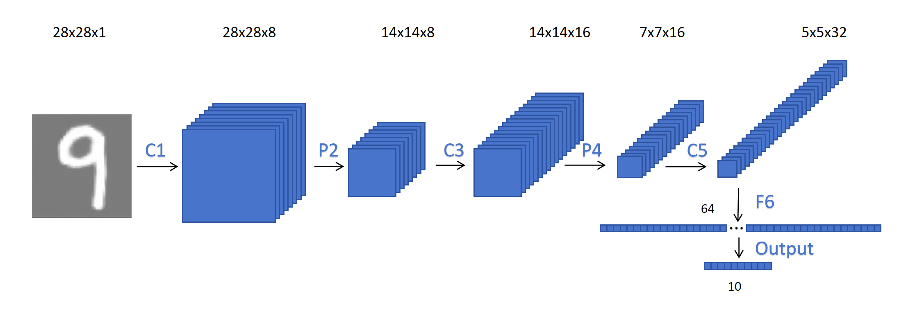
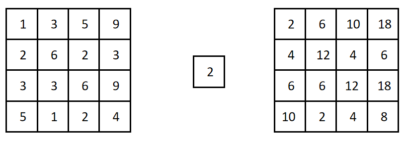
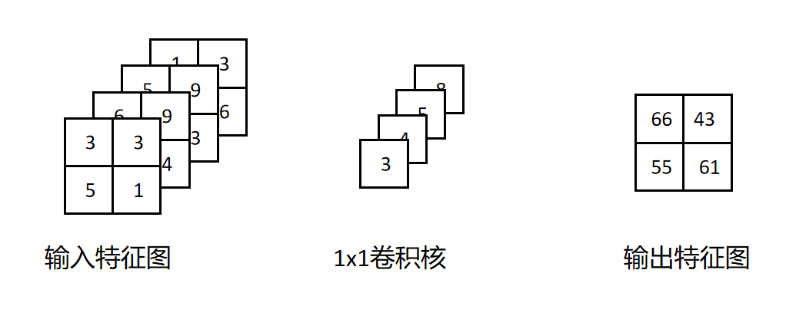
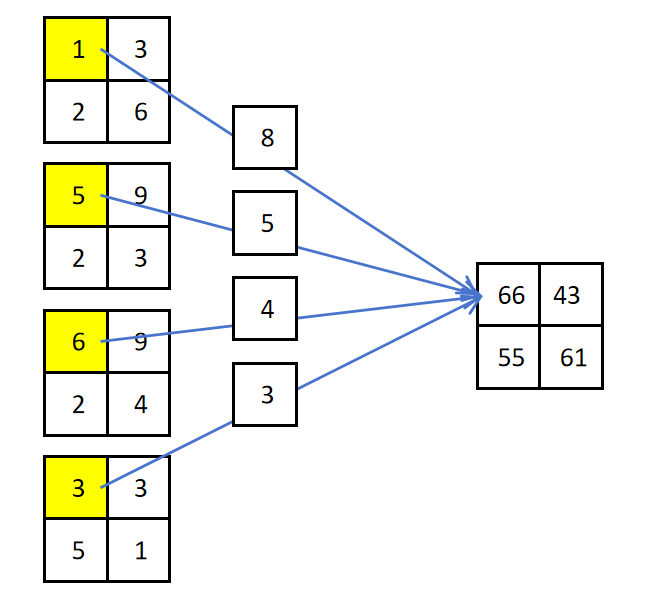
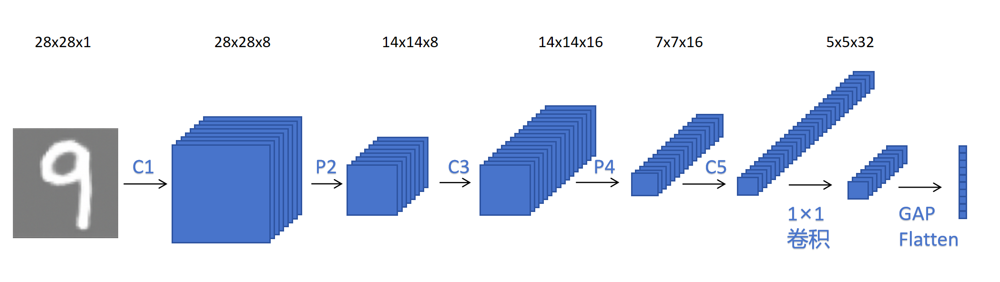

## 1. 动机：全连接层是参数大户



上一节的 CNN 里，全连接层占了 **88%** 的参数。

以卷积最后输出 5×5×32 为例，Flatten 后是 800 维，接 64 维全连接层：

$$
\text{参数量} = 800 \times 64 = 51{,}264
$$

这个 800（= 25×32）是被 Flatten 硬撑大的。今天的两个方法就是为了**降低这个被撑大的维度**。

---

## 2. 1×1 卷积

### 2.1 单通道上"没用"，多通道上"大有用处"



对单通道图，1×1 卷积只是把每个像素乘个系数，确实没用。

**但 1×1 卷积真正的作用是在多通道上——跨通道融合。**

### 2.2 本质：一个"跨通道的全连接神经元"



对一个 2×2×4 的输入，1×1 卷积核对某位置（如左上角）的计算：

```
把 4 个通道在该位置的值，加权求和 → 一个全连接操作
```



所以 1×1 卷积 = 一个**共享参数的全连接神经元**，专门融合同一位置上的多个通道特征，生成新特征。

### 2.3 最重要的作用：改变通道数

```
输入：W × H × C1
定义 C2 个 1×1 卷积 Filter
输出：W × H × C2   ← 尺寸不变，通道数从 C1 变 C2
```

| 特点 | 值 |
|------|-----|
| Padding | 0 |
| 步长 | 1 |
| 尺寸变化 | 不变 |
| 通道变化 | C1 → C2 |

### 2.4 降维示例

上一节卷积输出 5×5×32，用 4 个 1×1 卷积：

```
5×5×32 → (4 个 1×1 卷积) → 5×5×4
Flatten 后 = 25×4 = 100 维
全连接层参数 = 100×64 = 6400  ← 原来的 1/8
```

### 2.5 使用位置

1×1 卷积一般用在**网络深层**，对已经提取好的特征做融合，不会直接用在原始像素上。

---

## 3. 全局平均池化（GAP）

### 3.1 操作

对每个通道的**整个空间维度**取平均：

```
输入：W × H × C
GAP：每个通道求平均
输出：1 × 1 × C
```

例：5×5×32 → GAP → 1×1×32（每个通道的 25 个值求平均成一个值）。

### 3.2 特点

- **不引入任何参数**
- 直接压缩掉空间维度

### 3.3 降维效果

上例 5×5×32 → GAP → 1×1×32，再接 64 维全连接：

$$
\text{参数} = 32 \times 64 = 2{,}048 \quad (\text{原来的 } 1/25)
$$

---

## 4. 两者配合：彻底去掉全连接层

手写数字分类（10 类）的高级用法：

```
卷积最后输出：5×5×32
    ↓ 10 个 1×1 卷积（通道数 = 类别数）
5×5×10
    ↓ GAP
1×1×10
    ↓ Flatten + Softmax
分类结果
```



- 1×1 卷积把通道数调整为**类别数**（10）
- GAP 把每个通道压缩成一个值 → 恰好是每类的"得分"
- 直接 Softmax，**完全省去全连接层**

---

## 5. 去掉全连接层的好处

### 5.1 减少参数

全连接层是参数大头，去掉后模型显著变小。

### 5.2 支持任意尺寸输入

**这是更重要的好处。**

```
全连接层：参数在定义网络时就固定（如 36×8）
         → 反向锁死了输入尺寸必须 6×6

卷积 / 1×1 / GAP：对输入尺寸没有要求
         → 7×7、8×8、任意尺寸都能处理
```

因为卷积核只工作在小窗口上，图片大就多算几次；GAP 也是取平均，不依赖具体尺寸。所以**无全连接层的 CNN 可以接受任意大小的输入**。

---

## 6. 总结

```
问题：全连接层参数爆炸（占 88%）

方案一：1×1 卷积
  ├── 跨通道融合（= 共享参数的全连接神经元）
  ├── 改变通道数：W×H×C1 → W×H×C2
  └── 用于深层降维，如 32 → 4，参数减到 1/8

方案二：全局平均池化 GAP
  ├── 每个通道整体取平均
  ├── W×H×C → 1×1×C
  └── 无参数，如 5×5×32 → 32 维，参数减到 1/25

最强组合：1×1 + GAP + Softmax
  → 彻底移除全连接层
  → 参数大减 + 支持任意尺寸输入
```
