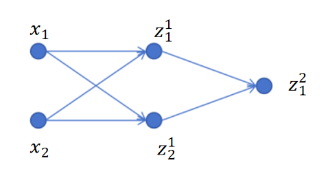
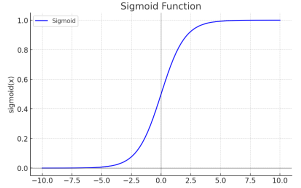
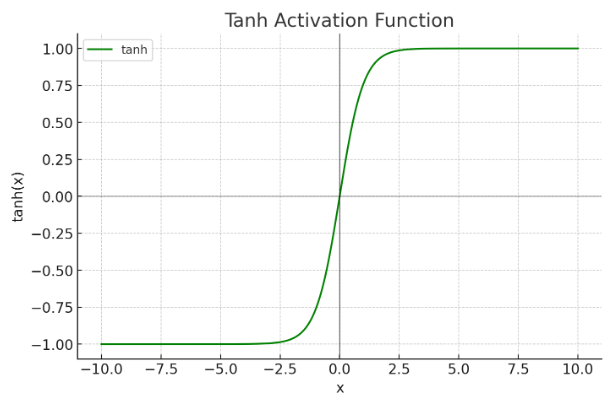
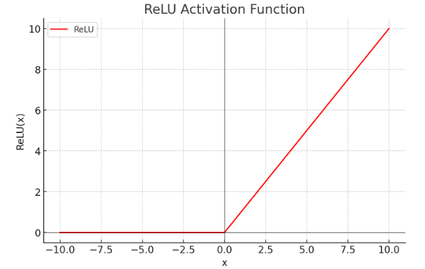
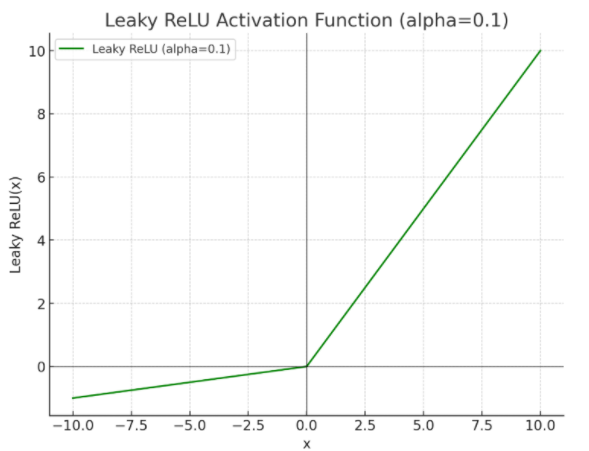

## 1. 激活函数的核心作用：引入非线性

### 1.1 没有激活函数会怎样？

以一个简单网络为例：1 个隐藏层（2 个神经元）+ 1 个输出层（1 个神经元），没有激活函数。


**隐藏层输出**（纯线性）：

$$
z_1^1 = x_1 w_{11}^1 + x_2 w_{21}^1 + b_1^1
$$
$$
z_2^1 = x_1 w_{12}^1 + x_2 w_{22}^1 + b_2^1
$$

**输出层**：

$$
z_1^2 = z_1^1 w_{11}^2 + z_2^1 w_{21}^2 + b_1^2
$$

### 1.2 代入消元

把 $z_1^1$ 和 $z_2^1$ 代入 $z_1^2$ 的表达式，展开合并：

$$
z_1^2 = (w_{11}^1 w_{11}^2 + w_{12}^1 w_{21}^2) \cdot x_1 + (w_{21}^1 w_{11}^2 + w_{22}^1 w_{21}^2) \cdot x_2 + (b_1^1 w_{11}^2 + b_2^1 w_{21}^2 + b_1^2)
$$

所有 w 和 b 可以组合成**新的系数**：

$$
z_1^2 = W_1' \cdot x_1 + W_2' \cdot x_2 + B'
$$

### 1.3 结论

**不管有多少层，如果没有激活函数，最终等价于一层的线性回归。**

堆叠层数的意义完全消失。激活函数就是那个打破这个等价关系的关键——在每层线性变换之后加一个**非线性函数**。

> 激活函数模拟了生物神经元的"抑制"和"激活"行为，让神经网络能拟合任意复杂的函数。

---

## 2. Sigmoid

### 公式

$$
\sigma(x) = \frac{1}{1 + e^{-x}}
$$

### 特点

| 属性 | 值 |
|------|-----|
| 输出范围 | (0, 1) |
| 优点 | 天然映射到概率，可解释性强 |
| 缺点 | 两端梯度趋近 0（梯度消失），输出不以 0 为中心 |

### 适用场景

**二分类问题的输出层**（最后一个神经元），将输出转为概率。隐藏层中已基本被 ReLU 替代。

---

## 3. Tanh（双曲正切）

### 公式

$$
\tanh(x) = \frac{e^x - e^{-x}}{e^x + e^{-x}}
$$

### 特点

| 属性 | 值 |
|------|-----|
| 输出范围 | (-1, 1) |
| 与 Sigmoid 的关系 | $\tanh(x) = 2\sigma(2x) - 1$，是 Sigmoid 的缩放平移版 |
| 优点 | 输出**以 0 为中心**，比 Sigmoid 更利于下一层的学习 |
| 缺点 | 同样存在两端**梯度消失**的问题 |

### 适用场景

历史上曾在隐藏层中使用较多。现在除特定场景（如 RNN / LSTM 内部）外，多数已被 ReLU 替代。

---

## 4. ReLU（Rectified Linear Unit）

### 公式

$$
\text{ReLU}(x) = \max(0, x)
$$

### 特点

| 属性 | 值 |
|------|-----|
| 输出范围 | [0, +∞) |
| x > 0 时 | 输出 = x，梯度 = 1（**没有梯度消失**） |
| x ≤ 0 时 | 输出 = 0，梯度 = 0 |

### 为什么 ReLU 是深度学习默认选择

- **计算极简单**：只是一个 max 操作，没有指数运算，前向和反向都极快
- **缓解梯度消失**：正半轴梯度恒为 1，深层网络也能有效传递梯度
- **稀疏激活**：负半轴输出为 0，意味着网络中只有一部分神经元在"工作"，类似生物神经系统的稀疏激活特性

### 缺点

当输入 ≤ 0 时梯度为 0，对应神经元的参数**永远不会更新**——称为"神经元死亡"问题。

---

## 5. Leaky ReLU

### 公式

$$
\text{LeakyReLU}(x) = \begin{cases} x & \text{if } x > 0 \\ \alpha x & \text{if } x \leq 0 \end{cases}
$$

$\alpha$ 通常取一个很小的值，如 0.01 或 0.1。

### 解决的问题

ReLU 在 x ≤ 0 时梯度为零 → 神经元可能永久死亡。Leaky ReLU 在负半轴给一个**微小的斜率** $\alpha$，保证永远有梯度可以更新参数。

| | ReLU | Leaky ReLU |
|------|------|------|
| x > 0 | 梯度 = 1 | 梯度 = 1 |
| x ≤ 0 | 梯度 = 0（死亡） | 梯度 = $\alpha$（微弱但非零） |

---

## 6. 总结

```
激活函数的作用：在线性变换后引入非线性
    没有它 → 多层 = 一层
    有了它 → 网络可以拟合任意复杂函数

四种激活函数对比：

    Sigmoid       → (0, 1)    → 二分类输出层专用
    Tanh           → (-1, 1)  → 以 0 为中心，历史常用
    ReLU           → [0, +∞)  → 当前默认选择，简单高效
    Leaky ReLU     → (-∞, +∞) → 修复 ReLU 神经元死亡问题

选择原则：
    隐藏层   → 默认用 ReLU（或其变体 Leaky ReLU）
    输出层   → 二分类用 Sigmoid，多分类用 Softmax（后文会讲），回归用恒等映射
```
