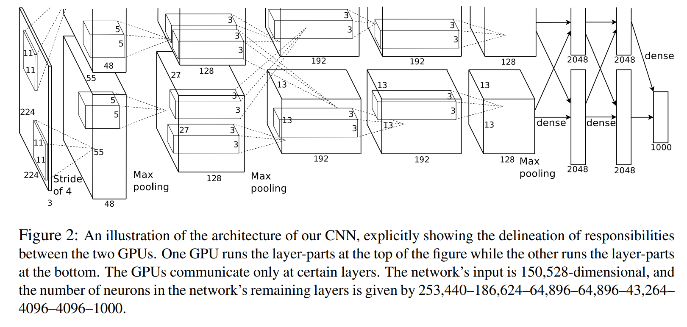

## 1. 背景：ImageNet 竞赛

### 1.1 ImageNet 数据集

| 项目 | 信息 |
|------|------|
| 提出 | 李飞飞团队，2009 年 |
| 规模 | 约 1,400 万张图，选 1,000 类，每类约 1,000 张精细标注 |
| 竞赛 | ILSVRC（2010 年起每年举办） |

此前计算机视觉依赖小数据集（CIFAR-10、MNIST）和手工特征（SIFT、HOG、SVM）。ImageNet 的 1000 类、百万级图像对传统方法构成巨大挑战。

### 1.2 2012 年的历史性突破

AlexNet（Alex Krizhevsky、Ilya Sutskever、Geoffrey Hinton）：

| 指标 | 之前最好 | AlexNet |
|------|---------|---------|
| Top-5 错误率 | 26% | **15%** |

**领先第二名 10 个百分点**，震惊业界，开启深度学习黄金时代。

---

## 2. 网络架构（8 层）



| 层 | 类型 | 输出尺寸 | 说明 |
|------|------|---------|------|
| 输入 | — | 224×224×3 | RGB 图像 |
| 1 | 卷积 11×11, stride 4 + ReLU + LRN + MaxPool | 55×55×96 | 大卷积核做初始特征提取 |
| 2 | 卷积 5×5 + ReLU + LRN + MaxPool | 27×27×256 | 局部响应归一化 |
| 3 | 卷积 3×3 + ReLU | 13×13×384 | 更细粒度特征 |
| 4 | 卷积 3×3 + ReLU | 13×13×384 | 与第 3 层配合提取复杂模式 |
| 5 | 卷积 3×3 + ReLU + MaxPool | 6×6×256 | 下采样提取语义 |
| 6 | 全连接 + ReLU + Dropout | 4096 | 高级分类特征 |
| 7 | 全连接 + ReLU + Dropout | 4096 | 防过拟合 |
| 8 | 全连接 + Softmax | 1000 | 输出 1000 类概率 |

> 结构图分上下两部分，是因为当时用**两块 GPU** 并行训练，只在特定层通信。

---

## 3. PyTorch 实现

```python
import torch
import torch.nn as nn

class AlexNet(nn.Module):
    def __init__(self, num_classes=1000):
        super(AlexNet, self).__init__()
        self.features = nn.Sequential(
            nn.Conv2d(3, 96, kernel_size=11, stride=4, padding=2),  # 输出: 96x55x55
            nn.ReLU(inplace=True),
            nn.LocalResponseNorm(size=5, alpha=1e-4, beta=0.75, k=2.0),
            nn.MaxPool2d(kernel_size=3, stride=2),  # 输出: 96x27x27

            nn.Conv2d(96, 256, kernel_size=5, padding=2),  # 输出: 256x27x27
            nn.ReLU(inplace=True),
            nn.LocalResponseNorm(size=5, alpha=1e-4, beta=0.75, k=2.0),
            nn.MaxPool2d(kernel_size=3, stride=2),  # 输出: 256x13x13

            nn.Conv2d(256, 384, kernel_size=3, padding=1),  # 输出: 384x13x13
            nn.ReLU(inplace=True),

            nn.Conv2d(384, 384, kernel_size=3, padding=1),  # 输出: 384x13x13
            nn.ReLU(inplace=True),

            nn.Conv2d(384, 256, kernel_size=3, padding=1),  # 输出: 256x13x13
            nn.ReLU(inplace=True),
            nn.MaxPool2d(kernel_size=3, stride=2)  # 输出: 256x6x6
        )
        self.classifier = nn.Sequential(
            nn.Dropout(p=0.5),
            nn.Linear(256 * 6 * 6, 4096),
            nn.ReLU(inplace=True),

            nn.Dropout(p=0.5),
            nn.Linear(4096, 4096),
            nn.ReLU(inplace=True),

            nn.Linear(4096, num_classes)
        )

    def forward(self, x):
        x = self.features(x)
        x = x.view(x.size(0), 256 * 6 * 6)
        x = self.classifier(x)
        return x
```

---

## 4. AlexNet 的五大关键创新

| 创新 | 说明 |
|------|------|
| **ReLU 激活** | 替代当时主流的 Sigmoid/Tanh，训练更快、不易梯度消失 |
| **Dropout** | 在全连接层随机丢弃神经元，大幅降低过拟合 |
| **GPU 并行训练** | 用两块 GPU 训练网络不同部分，提升效率 |
| **LRN（局部响应归一化）** | 前两层增强 ReLU 响应（后被 BatchNorm 取代） |
| **数据增强** | 从 256×256 随机裁 224×224、50% 水平翻转、光照扰动 |

---

## 5. AlexNet 的意义

```
更深的网络 + 大量数据 + 强大算力 = 深度学习胜利的三位一体
```

| 影响 | 说明 |
|------|------|
| 学术 → 工业 | Google、Facebook 等巨头全面转向神经网络 |
| CNN 黄金时代 | 之后更深网络（VGG、GoogLeNet、ResNet）纷纷涌现 |
| 硬件催化 | GPU 成为训练深度模型的标配 |

---

## 6. 总结

```
AlexNet (2012) 的突破：
  Top-5 错误率 26% → 15%，领先第二名 10 个百分点

五大创新：
  ReLU / Dropout / GPU 并行 / LRN / 数据增强

架构：8 层
  5 个卷积层 + 3 个全连接层
  大卷积核(11×11)起步 → 逐渐变小(3×3)

意义：
  证明了"深度 + 数据 + 算力"的力量
  让深度学习从学术走向工业
```
