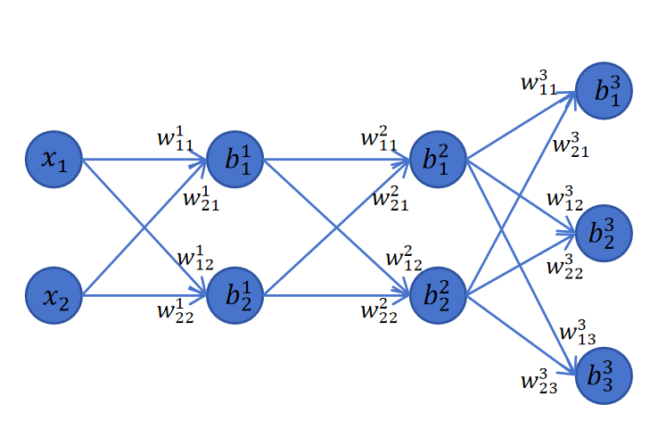

## 1. 网络结构定义

以本节示例网络为例：


```
输入(2维) → 隐藏层1(2神经元) → 隐藏层2(2神经元) → 输出层(3神经元，3分类)
                        ↑ 激活函数                    ↑ Softmax + 交叉熵
```

| 层 | 输入 | 权重形状 | 偏置形状 | 输出(logits) | 输出(激活后) |
|------|------|------|------|------|------|
| 第 1 层（隐藏） | $x$ (1×2) | $W^1$ (2×2) | $b^1$ (1×2) | $z^1$ | $a^1 = \text{act}(z^1)$ |
| 第 2 层（隐藏） | $a^1$ (1×2) | $W^2$ (2×2) | $b^2$ (1×2) | $z^2$ | $a^2 = \text{act}(z^2)$ |
| 第 3 层（输出） | $a^2$ (1×2) | $W^3$ (2×3) | $b^3$ (1×3) | $z^3$ | $a^3 = \text{Softmax}(z^3)$ |

---

## 2. 前向传播（Forward Pass）

### 2.1 通用一层

$$
z^l = a^{l-1} \cdot W^l + b^l
$$

$$
a^l = \text{act}(z^l)
$$

其中 $a^0 = x$（第一层输入就是原始特征）。

### 2.2 输出层（第 3 层）特殊处理

输出层用 Softmax：

$$
a_i^3 = \frac{e^{z_i^3}}{\sum_{j=1}^{3} e^{z_j^3}}
$$

损失函数用交叉熵（$y$ 是 one-hot 标签）：

$$
\text{loss} = -(y_1 \ln a_1^3 + y_2 \ln a_2^3 + y_3 \ln a_3^3)
$$

---

## 3. 反向传播的核心：定义 $\delta$

定义关键的中间变量（误差信号）：

$$
\delta^l = \frac{\partial \text{loss}}{\partial z^l}
$$

即 loss 对第 $l$ 层 **logits（激活前的值）** 的偏导数。

**有了 $\delta^l$，该层的权重梯度和偏置梯度就唾手可得。**

---

## 4. 输出层（第 3 层）的推导

### 4.1 第一步：求 $\delta^3$（loss 对 logits 的偏导）

这是整个反向传播的**起点**，也是最复杂的推导。经过 Softmax + 交叉熵的链式求导（[具体推导见原文](https://www.rethink.fun/chapter8/%E5%A4%9A%E5%88%86%E7%B1%BB%E7%A5%9E%E7%BB%8F%E7%BD%91%E7%BB%9C%E7%9A%84%E5%8F%8D%E5%90%91%E4%BC%A0%E6%92%AD.html)），分情况讨论后得到一个极简结果：

$$
\boxed{\frac{\partial \text{loss}}{\partial z_i^3} = a_i^3 - y_i}
$$

写成向量形式：

$$
\boxed{\delta^3 = a^3 - y}
$$

> 这个结果简洁得令人惊讶：预测概率 减去 真实标签（one-hot）。这也是交叉熵 + Softmax 组合被广泛使用的原因之一。

### 4.2 第二步：输出层的权重梯度

$$
\frac{\partial \text{loss}}{\partial W^3} = (a^2)^T \cdot \delta^3
$$

形状：$(2 \times 1) \times (1 \times 3) = (2 \times 3)$，与 $W^3$ 一致。

### 4.3 第三步：输出层的偏置梯度

$$
\frac{\partial \text{loss}}{\partial b^3} = \delta^3
$$

---

## 5. 梯度向上一层传播

### 5.1 求 loss 对上一层激活值 $a^2$ 的偏导

$$
\frac{\partial \text{loss}}{\partial a^2} = \delta^3 \cdot (W^3)^T
$$

### 5.2 求 $\delta^2$（loss 对第二层 logits 的偏导）

由于 $a^2 = \text{act}(z^2)$，链式法则乘上激活函数的导数：

$$
\boxed{\delta^2 = \frac{\partial \text{loss}}{\partial a^2} \odot \text{act}'(z^2) = \delta^3 (W^3)^T \odot \text{act}'(z^2)}
$$

其中 $\odot$ 是**逐元素相乘**（因为激活函数是对每个元素单独作用的）。

---

## 6. 规律浮现：任意层的通用公式

从上面的推导可以总结出**递归模式**。设网络共 $n$ 层（第 $n$ 层是输出层）：

### 6.1 起点（输出层）

$$
\boxed{\delta^n = a^n - y}
$$

### 6.2 递归传播（第 $i$ 层从第 $i+1$ 层获取 $\delta$）

$$
\boxed{\delta^i = \delta^{i+1} \cdot (W^{i+1})^T \odot \text{act}'(z^i)}
$$

### 6.3 权重梯度

$$
\boxed{\frac{\partial \text{loss}}{\partial W^i} = (a^{i-1})^T \cdot \delta^i}
$$

其中 $a^0 = x$。

### 6.4 偏置梯度（单样本）

$$
\boxed{\frac{\partial \text{loss}}{\partial b^i} = \delta^i}
$$

---

## 7. 一条数据的完整反向传播（本例 3 层）

```
δ³ = a³ − y                          ← 起点
∂loss/∂W³ = (a²)ᵀ · δ³               ← 输出层权重梯度
∂loss/∂b³ = δ³                        ← 输出层偏置梯度

δ² = δ³·(W³)ᵀ ⊙ act'(z²)            ← 误差传到第二层
∂loss/∂W² = (a¹)ᵀ · δ²               ← 第二层权重梯度
∂loss/∂b² = δ²                        ← 第二层偏置梯度

δ¹ = δ²·(W²)ᵀ ⊙ act'(z¹)            ← 误差传到第一层
∂loss/∂W¹ = xᵀ · δ¹                  ← 第一层权重梯度
∂loss/∂b¹ = δ¹                        ← 第一层偏置梯度
```

**规律一目了然**：每一层做三件事：
1. 用上层的 $\delta$ 算出本层的 $\delta$
2. 用本层的 $\delta$ 和本层的输入 $a^{i-1}$ 算出权重梯度
3. 偏置梯度 = 本层的 $\delta$

---

## 8. 批量数据（Batch）的修改

当 batch size = $N$ 时，输入变成矩阵 $(N \times d)$。只有两处需要调整：

### 8.1 输出层的 $\delta^n$ 多了系数 $1/N$

$$
\boxed{\delta^n = \frac{1}{N}(a^n - y)}
$$

原因：交叉熵对 $N$ 个样本的 loss 取了平均。

### 8.2 偏置梯度需要沿 batch 维度求和

一个 batch 内的 $N$ 条数据共享同一个偏置 $b$，所以 loss 对偏置的偏导是 $N$ 条数据各自贡献的加和：

$$
\boxed{\frac{\partial \text{loss}}{\partial b_j^i} = \sum_{k=1}^{N} \delta_{kj}^i}
$$

### 8.3 其他公式不变

- $\delta$ 递归传播：不变
- 权重梯度 $\partial \text{loss} / \partial W^i$：不变（矩阵乘法自动处理了 batch 求和）

---

## 9. 批量数据的最终完整公式

$$
\boxed{\delta^n = \frac{1}{N}(a^n - y)}
$$

$$
\boxed{\delta^i = \delta^{i+1} \cdot (W^{i+1})^T \odot \text{act}'(z^i)}
$$

$$
\boxed{\frac{\partial \text{loss}}{\partial W^i} = (a^{i-1})^T \cdot \delta^i}
$$

$$
\boxed{\frac{\partial \text{loss}}{\partial b_j^i} = \sum_{k=1}^{N} \delta_{kj}^i}
$$

---

## 10. 为什么叫"反向传播"

误差信号 $\delta$ 从输出层**一层一层往回传**：

```
loss → δⁿ → δⁿ⁻¹ → δⁿ⁻² → ... → δ¹
```

每传一层，用当前层的 $\delta$ 算出该层参数的梯度。整个过程是 loss 信息从末层逐层向前传播，所以叫**反向传播（Backpropagation）**。

---

## 11. 总结

```
反向传播 = 链式法则 + 矩阵运算

核心变量：δⁱ = ∂loss / ∂zⁱ（loss 对第 i 层 logits 的偏导）

一条数据的流程：
  δⁿ = aⁿ − y                          (起点：Softmax + CE 的优雅结果)
  ↓ 循环 i = n−1 ... 1:
  δⁱ = δⁱ⁺¹ · (Wⁱ⁺¹)ᵀ ⊙ act'(zⁱ)    (误差往前传)
  ∂loss/∂Wⁱ = (aⁱ⁻¹)ᵀ · δⁱ           (当前层权重梯度)
  ∂loss/∂bⁱ = δⁱ 的列和               (当前层偏置梯度)

批量数据只需改动两处：δⁿ 除以 N，偏置梯度沿 batch 求和。

PyTorch 中这一切都由 loss.backward() 自动完成。
```
