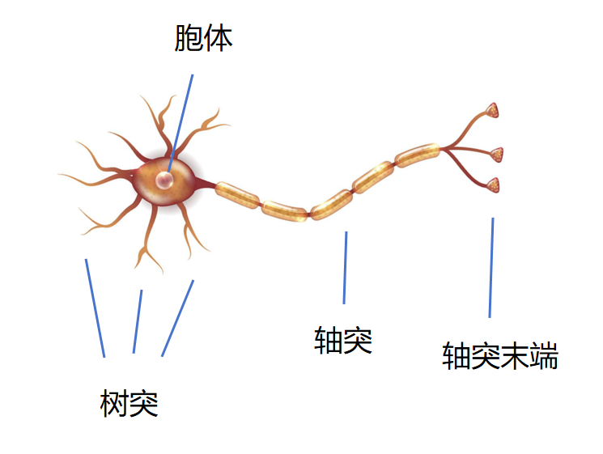
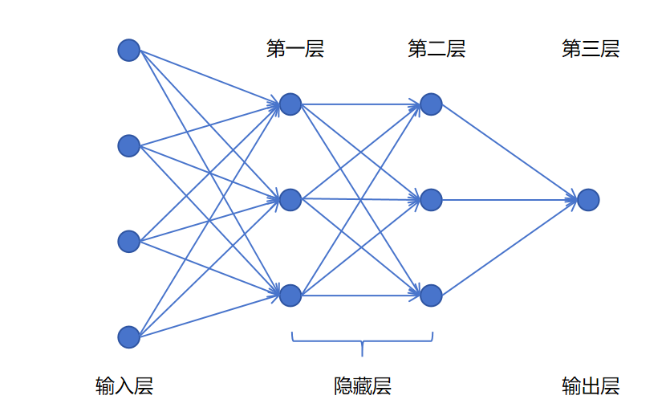

## 1. 生物神经元 → 人工神经元

### 1.1 生物神经元的结构

| 组成部分 | 角色 | 对应逻辑回归 |
|----------|------|-------------|
| **树突（Dendrites）** | 接收其他神经元传来的信号 | 输入特征 $x_1, x_2, \dots, x_n$ |
| **胞体（Soma）** | 整合输入信号，决定是否"激活"（输出 0 或 1） | 线性加权求和 + 激活函数 |
| **轴突（Axon）** | 将本神经元的输出传递给下一级神经元 | 输出值传给下一层 |



### 1.2 类比

一个神经元接收多个上游神经元的输入，根据自己的"判断规则"决定要不要激活并向下游传递信号。

一个逻辑回归接收多个特征输入，根据权重和偏置做线性变换，再经过 Sigmoid 将结果映射到 [0,1]：

- 输出接近 0 → 不激活
- 输出接近 1 → 激活

> 一个逻辑回归单元，就是一个人工神经元的简化数学模型。

---

## 2. 神经网络的结构

### 2.1 三层划分

```
输入层（Input Layer）     →  原始特征，没有可训练参数
隐藏层（Hidden Layer(s)）  →  负责从输入中逐层提取特征
输出层（Output Layer）     →  产生最终预测
```

### 2.2 层数怎么数

**不计算输入层。** 因为输入层就是数据本身，没有需要学习的参数。



例如上图：输入层 + 2 个隐藏层 + 输出层 → 这是一个**3 层神经网络**。

### 2.3 每一层内部

除了输入层，每一层的每个圆点代表一个**神经元**。

可以简单理解为：**一个神经元 ≈ 一个逻辑回归**。

第一层的每个神经元接收**所有**输入特征，各自输出一个值。这些输出又同时送给第二层的**所有**神经元。

### 2.4 层的命名

神经网络中的一层，有三个等价的名字：

| 名称 | 由来 |
|------|------|
| **线性层（Linear Layer）** | 每个神经元内部都是"线性变换 + 激活函数" |
| **全连接层（Fully Connected Layer）** | 本层每个神经元与上一层**每个**神经元都有连接 |
| **稠密层（Dense Layer）** | 全连接 = 连接稠密 |

最常用的叫法是 **全连接层** 或 **Dense 层**。

---

## 3. 层可以不断堆叠

上一节从一个逻辑回归，到加上一层隐藏层（3 个神经元）来提取高级特征。这一层提取了比原始特征更"高级"的表达。

不难想象：可以在这些高级特征的基础上，**再叠加一层**，提取**更高级的特征**。如此可以定义任意多层的隐藏层。

```
原始特征 → 隐藏层1（低级特征）→ 隐藏层2（中级特征）→ ... → 输出层
```

---

## 4. 深度神经网络

### 4.1 定义

严格意义上，**只要隐藏层 > 1 层，就可以叫深度神经网络**。

### 4.2 历史

神经网络理论最早可追溯到 **1943 年**，几起几落。直到被冠以"深度学习"这个名字后才广泛出圈——

> 一个好听的名字，有时候比技术本身更重要。

### 4.3 深度学习真正兴起的三个原因

| 原因 | 说明 |
|------|------|
| **架构统一可扩展** | 同一个框架下，加任意多层、每层加任意多神经元，能应对从简单到极复杂的所有问题 |
| **海量数据的出现** | 互联网、移动设备、社交媒体产生了前所未有的数据量；传统 ML 模型在海量数据面前纷纷欠拟合，只有深度网络能通过加深来持续提升性能 |
| **GPU 的发展** | 神经网络的核心运算是矩阵乘法，GPU 天生擅长并行矩阵计算，将训练速度提升了几个数量级 |

---

## 5. 总结

```
生物神经元                    人工神经元
  树突 ── 接收信号 ────────→    输入 x₁, x₂, ...
  胞体 ── 整合+激活 ────────→    wx + b + Sigmoid
  轴突 ── 输出传递 ────────→    输出值 → 下一层

大量神经元
  按层排列     →  神经网络
  层数 > 1    →  深度神经网络
  多层堆叠     →  逐层提取越来越抽象的特征
```

神经网络的本质就是：**用可学习的层堆叠起来，逐层自动提取特征，替代人工特征工程。**
