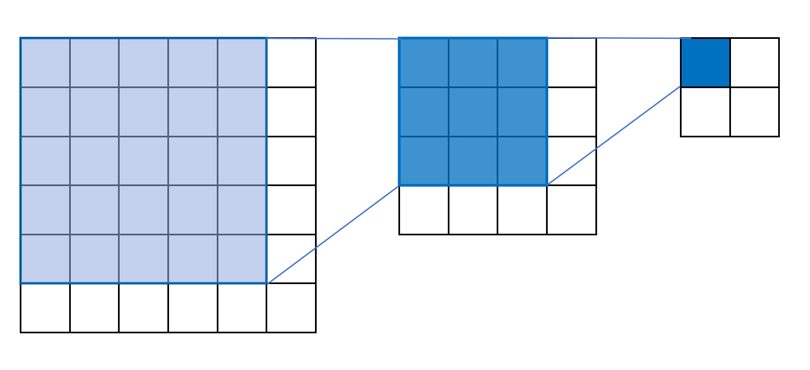
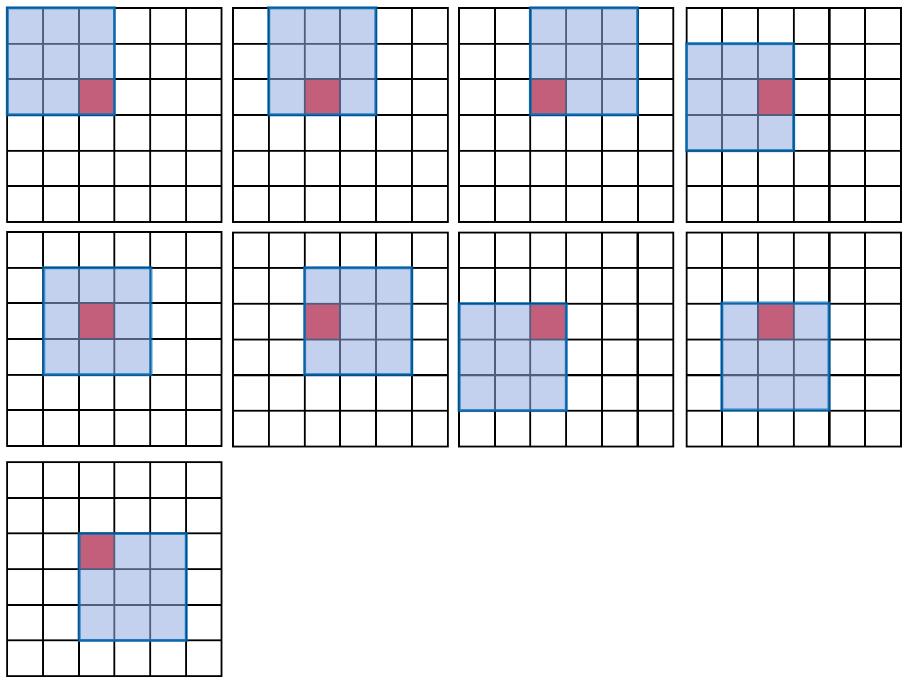
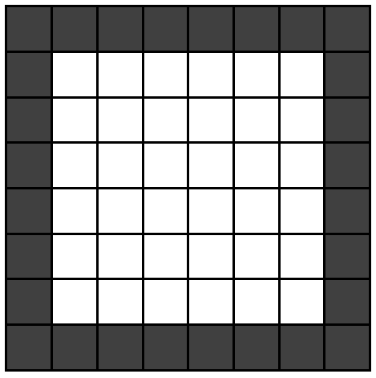
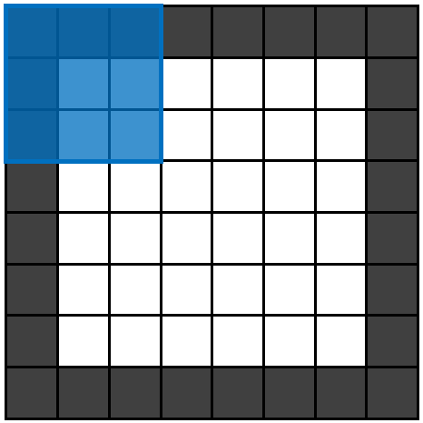

## 1. 感受野（Receptive Field）

### 1.1 定义

**感受野 = 当前特征图里的每个特征，是由原始图片多大区域的像素参与运算得到的。**

### 1.2 连续卷积，感受野逐渐扩大

| 阶段 | 特征图尺寸 | 每个特征的感受野 |
|------|-----------|----------------|
| 原始图 | 6×6 | — |
| 第 1 次 3×3 卷积 | 4×4 | **3×3** |
| 第 2 次 3×3 卷积 | 2×2 | **5×5** |



一层 3×3 卷积的感受野是 3×3，两层 3×3 卷积的感受野就变成 5×5。

### 1.3 关键规律

```
特征图尺寸：越来越小
感受野：越来越大

浅层 → 关注细节局部特征（小感受野）
深层 → 关注宏观整体特征（大感受野）
```

这也解释了为什么堆叠多个小卷积核比单个大卷积核更好——两层 3×3 的感受野等价于一层 5×5，但参数量更少（$2 \times 9 = 18$ vs $25$）。

---

## 2. 卷积核的大小

### 2.1 一般选奇数的正方形

- 3×3、5×5、7×7 等
- **奇数核有唯一的中心像素**，便于对称地定位特征

### 2.2 为什么最常用 3×3

- 参数少，计算快
- 叠加多层后感受野照样能变大（见上节）
- 不用担心"3×3 看到的像素太少"

---

## 3. 步长（Stride）

步长 = 卷积核每次滑动的像素数。

| 步长 | 效果 | 适用场景 |
|------|------|---------|
| 1 | 特征图缩小慢，保留细节 | 小卷积核（3×3），检测小特征 |
| 2 | 特征图缩小快 | 大卷积核（7×7），检测大特征 |

**原则**：小核配小步长，大核配大步长。小核设大步长容易漏掉特征。

---

## 4. Padding

### 4.1 卷积的两个问题

1. **特征图越来越小** — 图片小、层数多时很快就无法继续卷积
2. **边缘像素被"冷落"** — 中央像素参与 9 次计算，边缘像素只参与 1~4 次



### 4.2 Padding 的做法

在图片周围填充像素（最常用全 0 填充）：

```
Padding=1 → 周围加一圈 0
Padding=2 → 周围加两圈 0
```



6×6 图片 Padding=1 后变 8×8，再做 3×3 卷积（步长 1）→ 输出仍是 6×6。

### 4.3 Padding 解决两个问题

| 问题 | Padding 如何解决 |
|------|-----------------|
| 特征图变小 | 填充后再卷积，尺寸可保持不变 → 能堆更多层 |
| 边缘像素被冷落 | 边缘像素参与计算的次数增加了 |

---

## 5. 输出尺寸计算公式

### 5.1 公式

$$
W_{\text{out}} = 1 + \left\lfloor \frac{W_{\text{in}} + 2P - K}{S} \right\rfloor
$$

$$
H_{\text{out}} = 1 + \left\lfloor \frac{H_{\text{in}} + 2P - K}{S} \right\rfloor
$$

| 符号 | 含义 |
|------|------|
| $W_{\text{in}}, H_{\text{in}}$ | 输入宽、高 |
| $K$ | 卷积核尺寸 |
| $P$ | Padding 值 |
| $S$ | 步长 |
| $\lfloor \cdot \rfloor$ | 向下取整（除不尽时舍弃最后一步） |



### 5.2 公式理解

```
输出数 = 初始位置(1 个) + 还能移动多少次

还能移动多少次 = (填充后的宽度 - 卷积核宽度) / 步长
              = (W_in + 2P - K) / S

除不尽 → 向下取整 → 卷积核部分越界的最后一步被舍弃
```

### 5.3 保持尺寸不变：S=1 时 P 取多少？

要让 $W_{\text{out}} = W_{\text{in}}$：

$$
P = \frac{K - 1}{2}
$$

| 卷积核 K | 保持尺寸所需的 Padding |
|----------|----------------------|
| 3×3 | P = 1 |
| 5×5 | P = 2 |
| 7×7 | P = 3 |

**为了让 P 是整数，卷积核 K 必须是奇数** —— 这再次印证了"卷积核选奇数"的原因。

---

## 6. 总结

```
感受野：特征图每个像素对应原图的区域，层数越深越大
卷积核：选奇数（有唯一中心），最常用 3×3
步长  ：小核(3×3)配步长1，大核(7×7)可配步长2
Padding：填 0 保尺寸 + 让边缘像素被充分利用

输出尺寸公式：
  W_out = 1 + ⌊(W_in + 2P - K) / S⌋

保持尺寸不变（S=1）：
  P = (K-1)/2   → 所以 K 必须是奇数
```
