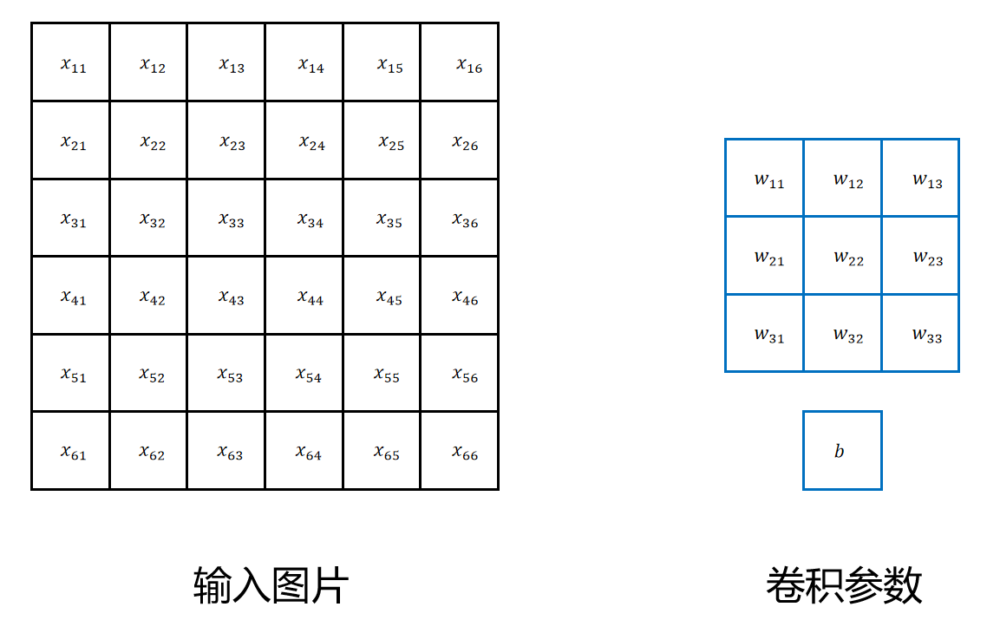
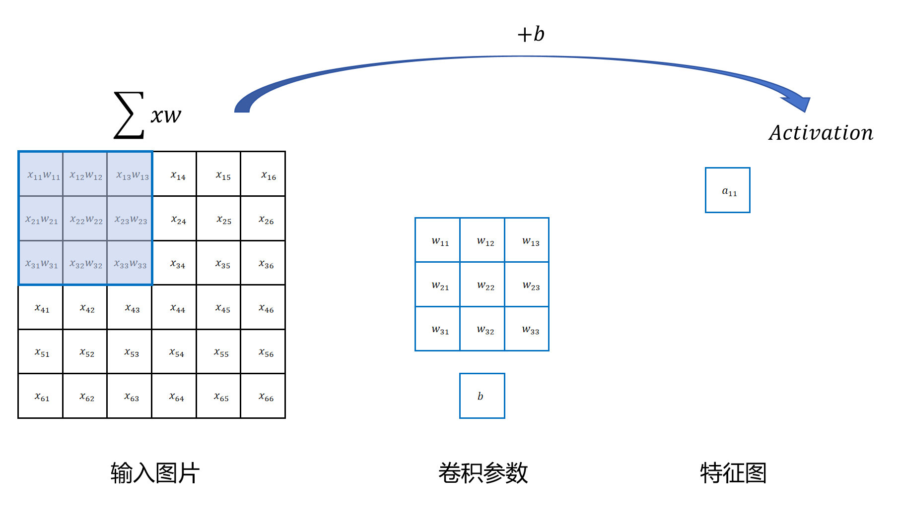
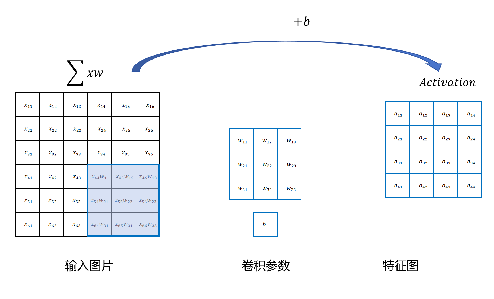
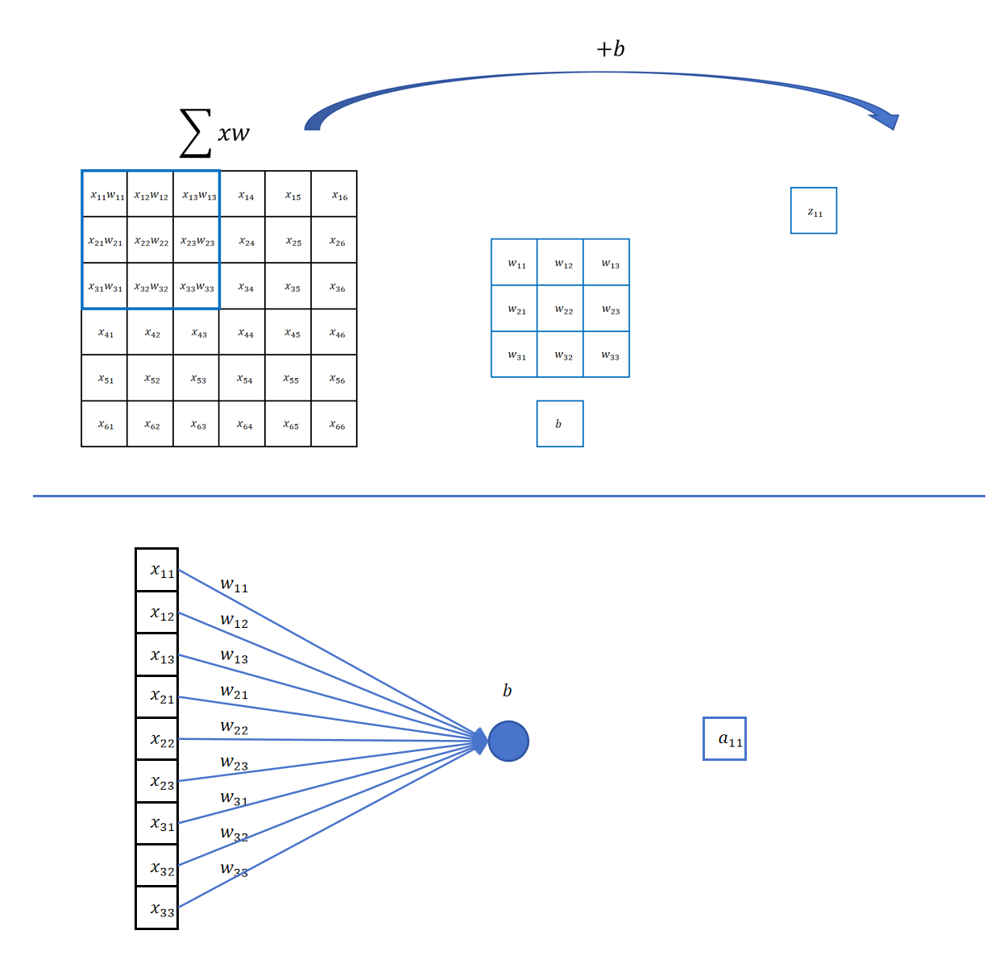
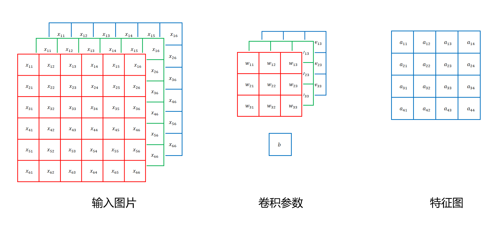
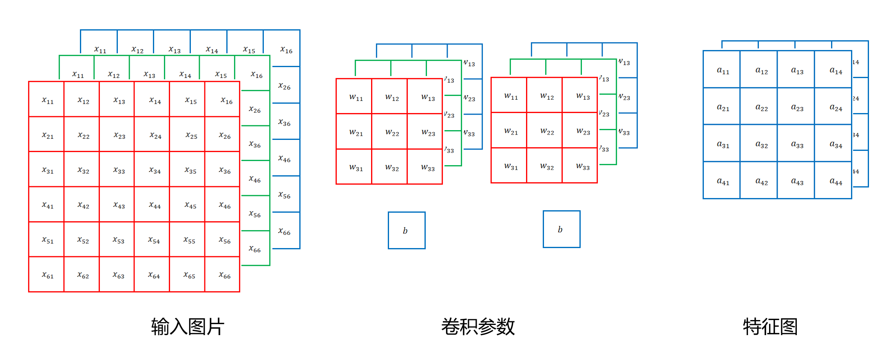

## 1. 卷积运算过程

### 1.1 输入与参数



| 概念 | 说明 |
|------|------|
| 输入 | 6×6×1 黑白图（H×W×C） |
| 卷积核 | 3×3 的权重矩阵，共 **9 个参数** |
| 偏置 b | 1 个参数 |
| **Filter（过滤器）** | 卷积核 + 偏置 = **10 个参数** |

### 1.2 滑动扫描

卷积核从图像左上角开始，从上到下、从左到右，每次与一个 3×3 的局部区域做运算：

$$
\text{z} = \sum_{i,j} (\text{像素}_{ij} \times \text{卷积核}_{ij}) + b
$$

$$
\text{a} = \text{激活函数}(z)
$$

每个 a 值成为新"特征图"上的一个"像素"，代表原图那个位置是否有某个特征（如猫的眼睛）。



扫描时每次移动的像素数称为 **步长（stride）**，步长=1 即每次右移/下移 1 个像素。

### 1.3 输出特征图

6×6 的图用 3×3 卷积核扫描完 → 得到一张新的特征图（这里尺寸也较小了，取决于 padding，后文会讲）。



---

## 2. 卷积操作完美解决了视觉的三个痛点

| 痛点 | 卷积如何解决 |
|------|-------------|
| 输入特征多 | 一个 3×3 卷积核只有 10 个参数，不随图片增大而增加 |
| 局部性 | 每次只在 3×3 的小窗口内运算 |
| 平移不变性 | **同一个卷积核用同样的参数在整张图上滑动** → 模式在哪都能检测到 |

---

## 3. 卷积 = 带先验知识的参数共享全连接层

卷积和全连接没有本质不同：

> 一个 3×3 卷积操作 = 一个只连接 9 个局部输入的神经元，有 9 个 weight + 1 个 bias。**这个神经元用同样的参数，在输入特征图的每个 3×3 区域上各计算一次，形成输出特征图。**



所以卷积可以理解为给全连接层加了两个**先验知识**：局部连接 + 参数共享。

---

## 4. 多通道卷积

### 4.1 RGB 输入怎么办

输入是三通道的（如 6×6×3），卷积核也必须是三通道的（3×3×3）。



**计算过程**：
1. 三个通道分别与对应的卷积核通道做卷积
2. 三个通道的结果相加
3. 加上一个偏置 b
4. 过激活函数

```python
# 伪代码：多通道卷积
z = (R通道像素 · R通道卷积核).sum()
  + (G通道像素 · G通道卷积核).sum()
  + (B通道像素 · B通道卷积核).sum()
  + b
```

| 输入通道数 | 卷积核通道数 | 偏置个数 | 总参数 | 输出通道数 |
|-----------|------------|---------|--------|-----------|
| 1 | 1 | 1 | 10 | 1 |
| **3** | **3** | 1 | **28** (3×3×3+1) | 1 |

---

## 5. 多 Filter — 同时检测多种特征

一个卷积核只能检测一种特征（如猫的眼睛）。要同时检测眼睛、耳朵、嘴巴、鼻子，需要**多个 Filter**。



- 1 个 Filter = 1 个卷积核 + 1 个偏置 → 输出 1 个通道
- **M 个 Filter → 输出 M 个通道**

```
输入: 6×6×3 (H×W×C_in)
卷积层: 定义 2 个 Filter，每个 Filter 的卷积核为 3×3×3
输出: 4×4×2 (H'×W'×C_out = 2)

关键：C_out = Filter 个数，C_in = 输入通道数
      每个 Filter 的卷积核通道数必须 = C_in
```

---

## 6. 堆叠多个卷积层

和深度神经网络一样，卷积层也可以堆叠：

```
原始图像（RGB, 3通道）
    ↓ 第 1 个卷积层（M₁ 个 Filter）→ 检测点、线、纹理等低级特征
特征图 1（M₁ 通道）
    ↓ 第 2 个卷积层（M₂ 个 Filter）→ 在低级特征上检测眼睛、鼻子等高级特征
特征图 2（M₂ 通道）
    ↓ ...
```

- 每一层的**输入通道数 = 上一层输出通道数**
- 每个 Filter 的卷积核通道数 **必须 = 输入特征图的通道数**
- 浅层检测低级特征（边缘、纹理），深层组合出高级特征（器官、物体）

---

## 7. 直观理解：卷积核是"特征探测器"

### 7.1 竖条纹检测器

一张 3×3 图片，中间一列黑两边白：

```
[50, 50, 100]
[50, 50, 100]
[50, 50, 100]
```

卷积核：`[[-1, 0, 1], [-1, 0, 1], [-1, 0, 1]]`

计算输出 = **150**（数值大 → 检测到竖条纹）。

### 7.2 同样的卷积核遇到纯色块

```
[50, 50, 50]
[50, 50, 50]
[50, 50, 50]
```

计算输出 = **0**（没有竖条纹）。

### 7.3 同样的卷积核遇到横条纹

```
[50, 50, 50]
[50, 50, 50]
[100, 100, 100]
```

计算输出 = **0**（没有竖条纹）。

> 卷积核 C1 就是一个**竖条纹检测器**。同理可以设计横条纹检测器、斜条纹检测器。

**训练时不需要手动设计**——网络会自动学到最合适的卷积核权重。

---

## 8. PyTorch 中的格式：CHW vs HWC

| 框架 | 格式 | 示例形状 |
|------------|------|---------|
| 本文 | HWC（高×宽×通道） | [224, 112, 3] |
| **PyTorch** | **CHW（通道×高×宽）** | **[3, 224, 112]** |

调试 PyTorch 代码时注意这个差异。

---

## 9. 总结

```
卷积操作 = 小窗口 + 滑动 + 参数共享

一个 Filter 做的事：
  z = 像素 · 卷积核 + b  （局部加权求和）
  a = 激活(z)             （过一个非线性）
  → 一个输出特征图上的"像素"

多通道输入 → 卷积核有相同通道数
多 Filter  → 输出通道数 = Filter 个数
多层堆叠   → 从低级特征提取到高级特征

一个 3×3 卷积核只有 10 个参数，就能在任意大的图上提取特征。
关键是：局部性（小窗口）+ 平移不变性（参数共享）。
```
