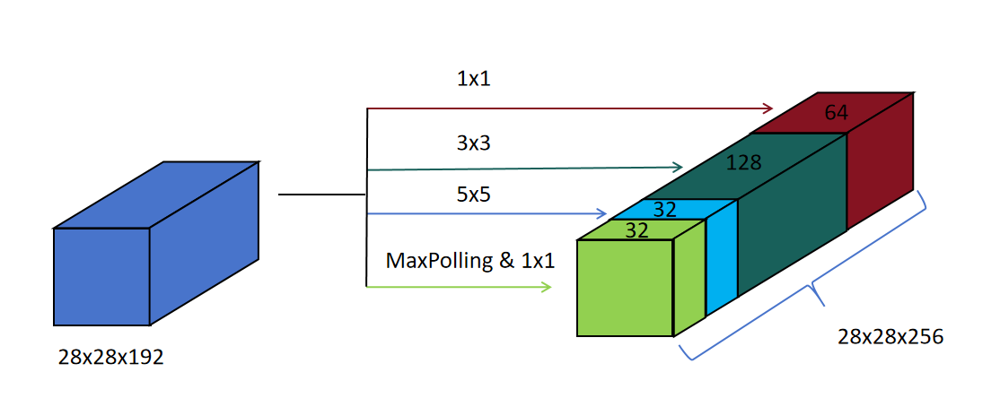
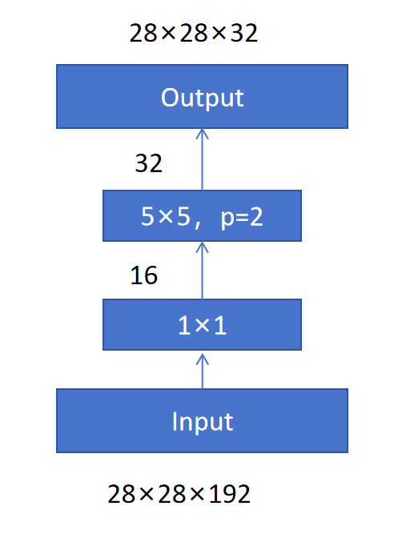
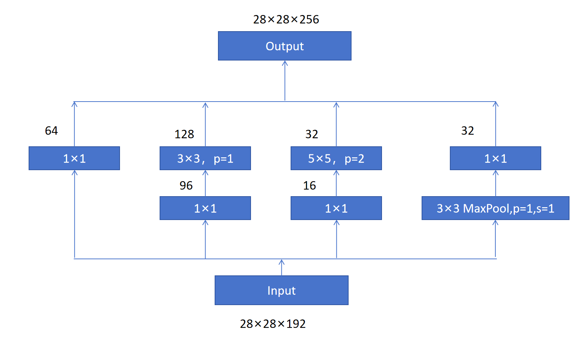
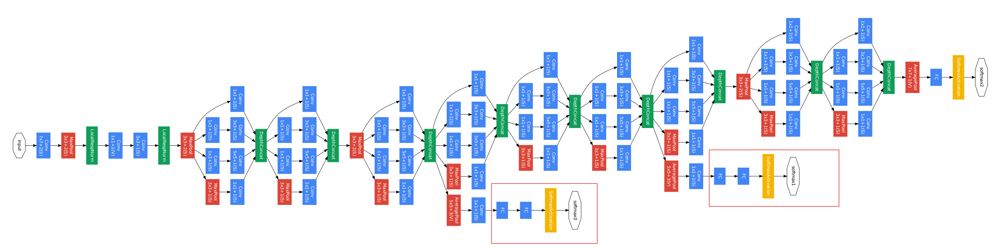

## 1. GoogLeNet 的成绩

| 项目 | 信息 |
|------|------|
| 团队 | Google，2014 年 |
| 成绩 | ILSVRC 2014 冠军，Top-5 错误率 **6.7%** |
| 地位 | 几乎把前一年冠军的错误率腰斩 |

名字由来：向 LeNet 致敬，把 Google 里的 L 大写，让 GoogLeNet 里包含一个 LeNet。

---

## 2. Inception 模块：不做选择，全都要

### 2.1 面临的选择



输入 28×28×192 的特征图，接下来用池化还是卷积？卷积核选 1×1、3×3 还是 5×5？

**Inception 的回答：不做选择，全都要。**

### 2.2 并行四路操作

| 路径 | 操作 | 输出尺寸 |
|------|------|---------|
| ① | 64 个 1×1 卷积 | 28×28×64 |
| ② | 128 个 3×3 卷积（P=1, S=1） | 28×28×128 |
| ③ | 32 个 5×5 卷积（P=2, S=1） | 28×28×32 |
| ④ | 2×2 最大池化（P=1, S=1）+ 32 个 1×1 卷积 | 28×28×32 |

四路输出的**长宽一致**，只是通道数不同 → 按通道合并：

$$28 \times 28 \times (64 + 128 + 32 + 32) = 28 \times 28 \times 256$$

### 2.3 问题：参数和计算量爆炸

以 5×5 卷积为例：



- 参数量：$5 \times 5 \times 192 \times 32 = 153{,}600$
- 计算量：$4800 \times 25{,}088 = 120{,}422{,}400$​（约 1.2 亿）

---

## 3. 1×1 卷积降维：参数降到十分之一

在 5×5 卷积**之前**插入 16 个 1×1 卷积（把通道从 192 降到 16）：

| | 无 1×1 | 有 1×1 |
|------|--------|--------|
| 参数量 | 153,600 | **15,872** |
| 计算量 | 120,422,400 | **12,443,648** |

**两者都缩减到原来的约十分之一。**

同样，3×3 卷积前也加 1×1 卷积降维。这就是 Inception 模块的完整形态：



```
输入 (192通道)
  ├── 1×1 卷积 → 降维 → 3×3 卷积
  ├── 1×1 卷积 → 降维 → 5×5 卷积
  ├── 1×1 卷积
  └── 池化 → 1×1 卷积
  四路合并 → 输出
```

---

## 4. GoogLeNet 架构

```
卷积 + 池化（初步特征提取）
  ↓
多个 Inception 模块
  ↓
MaxPooling（降低长宽）
  ↓
更多 Inception 模块
  ↓
全连接层 → 分类
```

### 辅助分类器（红框部分）



训练时，对**中间隐藏层**的特征也直接接分类器做训练。

**作用**：强制中间层提取的特征也对分类有帮助，增强训练监督信号（缓解深层网络的梯度消失）。

---

## 5. GoogLeNet 的意义

| 创新 | 说明 |
|------|------|
| **多尺度并行卷积** | 并行使用 1×1/3×3/5×5 + 池化，同时捕捉不同尺度特征，突破堆叠单一卷积的模式 |
| **1×1 卷积革新应用** | 通道降维 + 非线性增强，成为后续模型设计的标配 |

---

## 6. 总结

```
GoogLeNet (2014) = Inception 模块堆叠

Inception 思想：
  不做选择（池化 or 卷积，1×1 or 3×3 or 5×5），全都要
  → 并行多尺度卷积 → 按通道合并

问题与解法：
  全都要 → 参数爆炸
  → 1×1 卷积降维 → 参数和计算量降到 1/10

成绩：
  Top-5 错误率 6.7%，几乎腰斩前一年冠军
```
