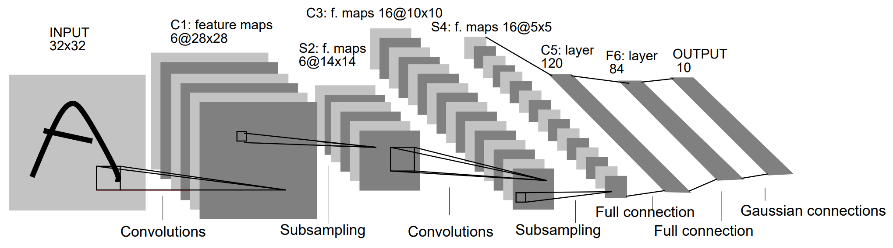

## 1. LeNet 的历史地位

| 项目 | 信息 |
|------|------|
| 提出者 | Yann LeCun 等 |
| 时间 | 1998 年 |
| 地位 | 第一个成功应用的卷积神经网络 |
| 用途 | 识别手写邮政编码（美国邮政局） |

> 在 LeNet 之前虽有类似卷积研究，但 LeNet 首次把**卷积 + 池化 + 反向传播**系统性地组合起来，奠定了现代计算机视觉的基础。

---

## 2. 网络结构



```
Input  1×32×32  灰度图（MNIST 的 28×28 用 zero-padding 补到 32×32）
  ↓
C1  卷积 6 个 5×5  → 6×28×28
  ↓
S2  平均池化 2×2   → 6×14×14
  ↓
C3  卷积 16 个 5×5 → 16×10×10
  ↓
S4  平均池化 2×2   → 16×5×5
  ↓
C5  卷积 120 个 5×5 → 120×1×1  （等价于全连接）
  ↓
F6  全连接 → 84 个神经元
  ↓
Output  全连接 → 10 类（数字 0-9）
```

### 2.1 三个与"现代"不同的历史细节

| 细节 | LeNet（1998） | 现代 CNN |
|------|--------------|----------|
| 输入尺寸 | 32×32 | 各种尺寸 |
| 池化 | **平均池化** | 最大池化 |
| 激活函数 | **Sigmoid / tanh** | ReLU |

---

## 3. 逐层尺寸变化

| 层 | 类型 | 输出尺寸 | 通道数 |
|------|------|---------|--------|
| Input | — | 32×32 | 1 |
| C1 | 卷积 5×5（无 padding） | 28×28 | 6 |
| S2 | 平均池化 2×2 | 14×14 | 6 |
| C3 | 卷积 5×5 | 10×10 | 16 |
| S4 | 平均池化 2×2 | 5×5 | 16 |
| C5 | 卷积 5×5 | 1×1 | 120 |
| F6 | 全连接 | — | 84 |
| Output | 全连接 | — | 10 |

尺寸不断缩小，通道不断增多——这正是 CNN 的经典结构规律（前面章节已讲过）。

---

## 4. PyTorch 实现

```python
import torch
import torch.nn as nn
import torch.nn.functional as F

class LeNet(nn.Module):
    def __init__(self):
        super(LeNet, self).__init__()
        # C1: 输入1通道，输出6通道，卷积核5x5
        self.conv1 = nn.Conv2d(1, 6, kernel_size=5)
        # S2: 平均池化层
        self.pool1 = nn.AvgPool2d(kernel_size=2, stride=2)
        # C3: 输入6通道，输出16通道
        self.conv2 = nn.Conv2d(6, 16, kernel_size=5)
        # S4: 平均池化
        self.pool2 = nn.AvgPool2d(kernel_size=2, stride=2)
        # C5: 全连接等价层（输入16×5×5 -> 输出120）
        self.conv3 = nn.Conv2d(16, 120, kernel_size=5)
        # F6: 全连接层
        self.fc1 = nn.Linear(120, 84)
        # Output: 输出10类
        self.fc2 = nn.Linear(84, 10)

    def forward(self, x):
        x = F.tanh(self.conv1(x))     # C1 + 激活
        x = self.pool1(x)             # S2
        x = F.tanh(self.conv2(x))     # C3 + 激活
        x = self.pool2(x)             # S4
        x = F.tanh(self.conv3(x))     # C5 + 激活
        x = x.view(-1, 120)           # 展平
        x = F.tanh(self.fc1(x))       # F6
        x = self.fc2(x)               # 输出层
        return x
```

---

## 5. LeNet 的意义

| 方面 | 意义 |
|------|------|
| **首次落地** | CNN 第一次成功应用于现实问题（手写邮编识别） |
| **性能** | MNIST 准确率超 99.2%，远超当时的传统算法 |
| **自动学特征** | 用卷积核自动学习图像特征，省去手工特征设计 |
| **范式确立** | 首次系统性引入 Padding、卷积、池化、全连接——**这套骨架沿用至今** |

LeNet 结构简单、效率高、准确率高，是 CNN 发展史上当之无愧的里程碑。

---

## 6. 总结

```
LeNet-5 (1998) = 卷积 → 池化 → 卷积 → 池化 → 卷积 → 全连接 → 全连接

结构：1×32×32 → [Conv 5×5 + 池化]×2 → Conv → FC → FC → 10类

历史细节：
  平均池化（非最大池化）
  Sigmoid/tanh（非 ReLU）
  输入 32×32（MNIST 28×28 补零）

意义：
  第一个成功的 CNN
  自动学特征，替代手工设计
  奠定了现代 CNN 的架构范式
```
