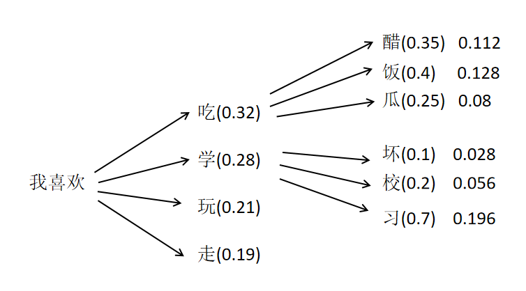
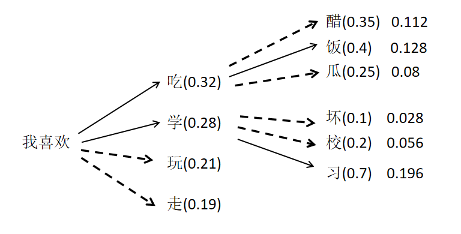
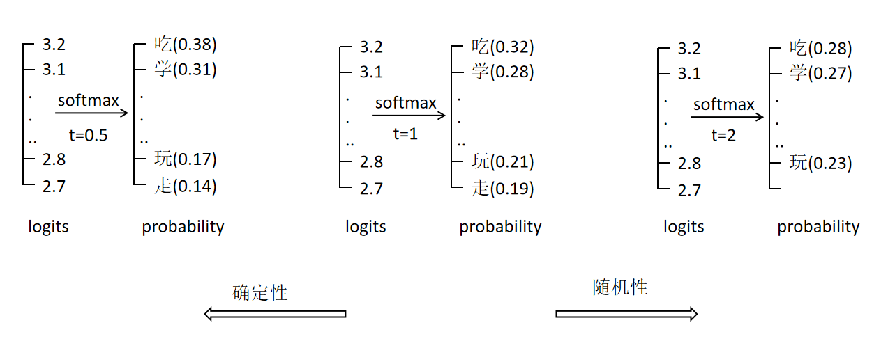

## 1. 计算文本序列的概率

语言模型能输出一句话中每个 token 的概率，连乘得到整句合理性概率：

$$P(\text{句子}) = P(t_1) \cdot P(t_2) \cdot \dots \cdot P(t_n)$$

- 应用：语音识别消歧（"洗澡" vs "洗枣"，取概率大的）
- 实际实现：每个 token 概率很小，连乘下溢 → 用 **log 相加**代替连乘

---

## 2. 生成文本（逐词续写）

大模型的核心能力：不断预测下一个最可能的 token。

```
"今天天气" → 预测下一个 token → "真"
"今天天气真" → 预测 → "好"
"今天天气真好" → 预测 → ...
直到输出 <eos> 停止
```

---

## 3. 贪婪策略：每步最大 ≠ 整体最大

### 3.1 贪婪策略

每一步都选**当前概率最大**的 token。



### 3.2 陷阱

我们要的是**整个序列联合概率最大**，不是每步最大。

```
贪心：每步取最大 → "我喜欢吃饭"
实际："我喜欢学习" 的联合概率更高
```

一步选错，后面再大也回不来了。

### 3.3 Beam Search（束搜索）

贪心每步只保留 1 个序列，Beam Search 保留 **Beam 个**候选序列：



```
Beam = 2：
第 1 步：保留 "我喜欢吃"(0.32) 和 "我喜欢学"(0.28)
第 2 步：两个序列各自预测下一个 token
        → "我喜欢吃饭"(0.128) 和 "我喜欢学习"(0.196)
第 3 步：继续保留概率最大的 2 个序列...
最终输出联合概率最大的序列
```

| Beam 大小 | 效果 |
|-----------|------|
| 大 | 更可能找到联合概率最大序列 |
| 小 | 更快，但可能错过最优 |

> Beam 越大越接近全局最优，但计算量也越大。

---

## 4. 随机生成策略

贪心和 Beam Search 生成结果**固定**。想让模型每次讲不一样的笑话，需要随机性。

### 4.1 Top-k

1. 取 logits 最大的 k 个 token
2. 其余 token 的 logits 设为极大负数
3. Softmax 后，非 Top-k 的 token 概率 = 0
4. 按概率随机采样

### 4.2 Top-p（核采样）

1. 按概率从大到小累加，直到累加和 > p
2. 这些 token 作为候选
3. 对候选重新 Softmax（概率和为 1）
4. 按更新后概率随机采样

### 4.3 Temperature（温度）

logits 先除以温度 t，再做 Softmax：

$$\text{softmax}\left(\frac{\text{logits}}{t}\right)$$



| 温度 t | 效果 |
|--------|------|
| 小（如 0.5） | 概率差异**大**，生成确定 |
| 大（如 2.0） | 概率差异**小**，生成随机 |

**规律**：温度越小越确定，温度越大越随机。

---

## 5. 总结

```
计算序列概率：token 概率连乘 → log 相加（防下溢）

生成文本：逐词预测下一个 token，直到 <eos>

确定性策略：
  贪婪     → 每步最大，但整体未必最大
  Beam Search → 保留 Beam 个候选，接近全局最优

随机性策略（让生成多样）：
  Top-k      → 只保留概率最大的 k 个
  Top-p      → 保留概率累加刚好 > p 的一批
  Temperature → logits/t，控制概率分布的尖锐程度

温度规律：越小越确定，越大越随机
```
