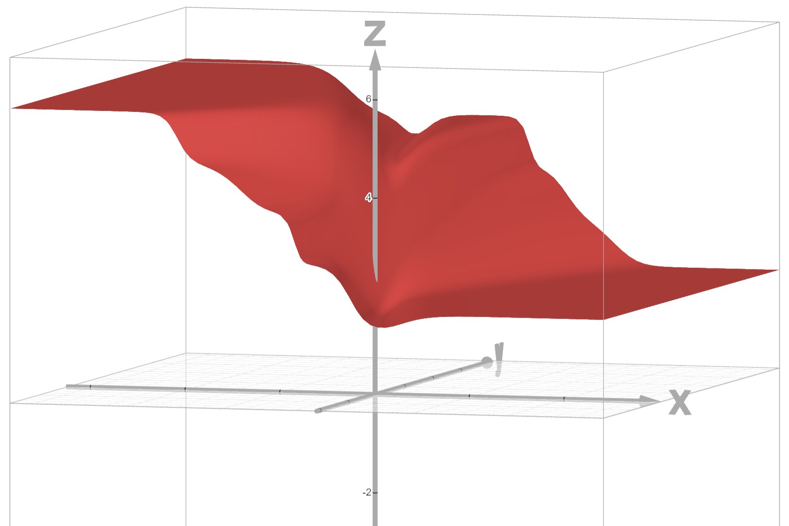
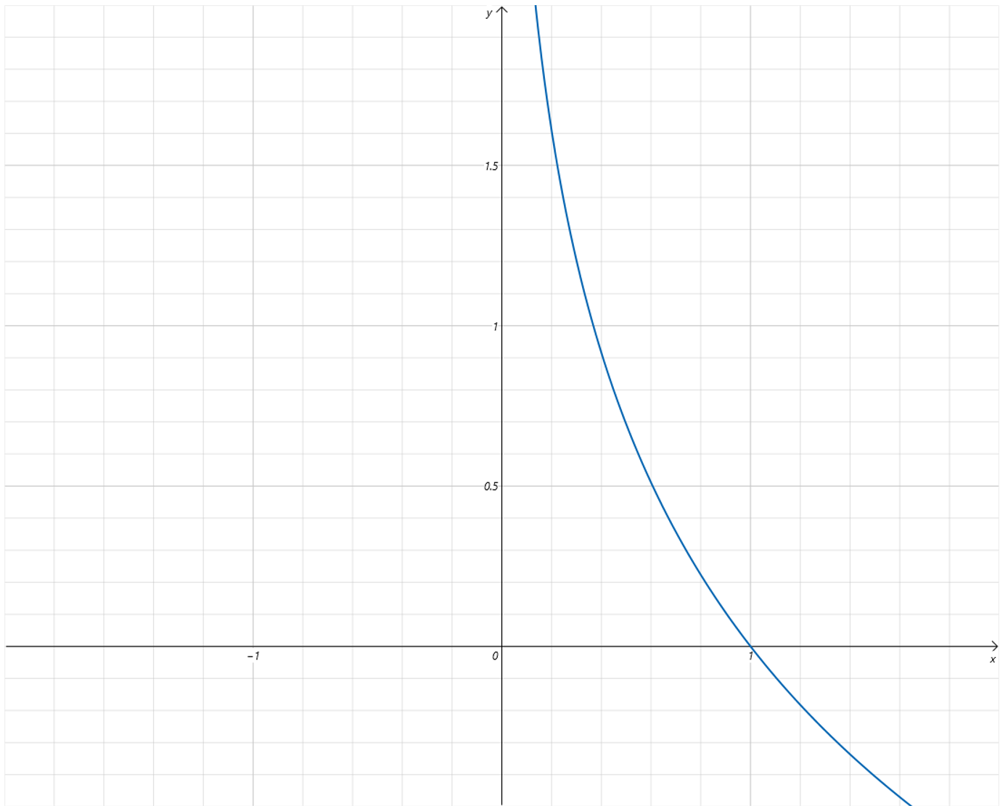
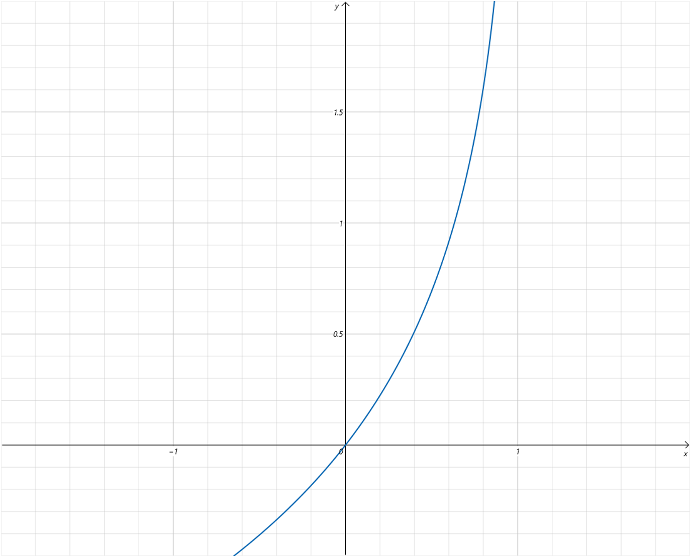
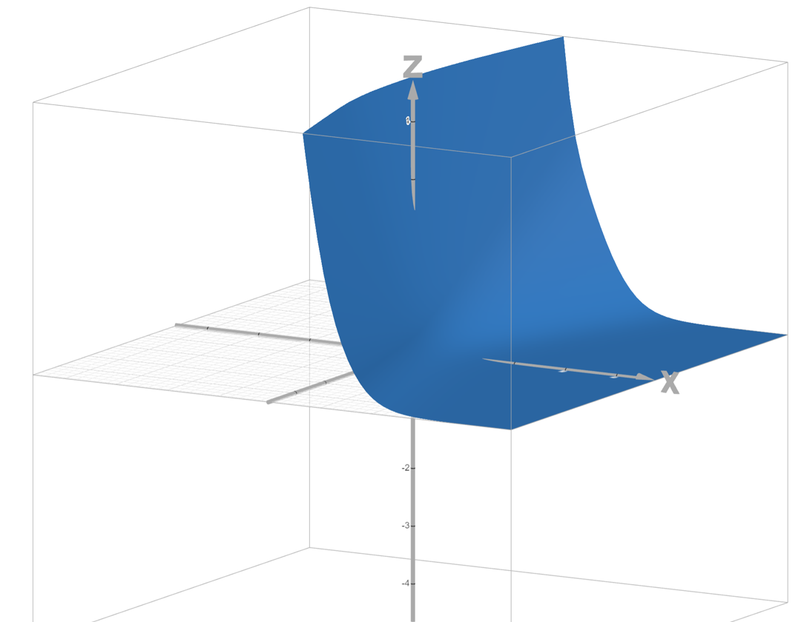

## 1. 回顾：构建模型 = 假设函数 + 损失函数 + 优化

一个完整的模型由三部分组成：

```
输入 → 假设函数（模型结构） → 预测值 → 损失函数 → 梯度下降优化参数
```

上一节确定了逻辑回归的**假设函数**：

$$\hat{y} = \frac{1}{1 + e^{-(wx+b)}}$$

这一节要确定它的**损失函数**——用来衡量预测值 $\hat{y}$ 和真实值 $y$ 之间的差距。

---

## 2. 试试 MSE？—— 不行

### 2.1 套用 MSE

线性回归用的 MSE：

$$\text{MSE} = \frac{1}{n} \sum (\hat{y}_i - y_i)^2$$

把它用在"气温预测是否出门"的数据上。将假设函数代入 MSE 后，表达式只含 w 和 b 两个变量。

### 2.2 MSE 的问题

画出 loss 随 w、b 变化的曲面（Z 轴 = loss，X 轴 = w，Y 轴 = b）：



- 是一个**非凸函数（non-convex）**
- 存在**很多局部最小值**
- 梯度下降很容易卡在局部最小，训练很不稳定

**结论**：MSE 不适合逻辑回归，需要专门为分类问题设计的损失函数。

---

## 3. 交叉熵损失（BCELoss）登场

### 3.1 二分类交叉熵 — 分情况定义

BCELoss（Binary Cross Entropy Loss）根据真实标签 $y$ 的取值，分为两种情况：

**当 $y = 1$ 时（正例）**：

$$\text{BCELoss} = -\log(\hat{y})$$



**当 $y = 0$ 时（负例）**：

$$\text{BCELoss} = -\log(1 - \hat{y})$$​



### 3.2 从函数图像直观理解

> **先看 $y=1$ 的情况**（真实标签为正例）：

- $\hat{y}$ 是 Sigmoid 的输出，取值 (0, 1)
- 当 $\hat{y} \to 0$（预测错），$-\log(\hat{y}) \to +\infty$，**损失极大** — 严惩
- 当 $\hat{y} \to 1$（预测对），$-\log(\hat{y}) \to 0$，**损失趋近 0** — 无惩罚
- 当 $\hat{y} = 1$（完全正确），损失 = 0

> **再看 $y=0$ 的情况**（真实标签为负例）：

- 当 $\hat{y} \to 1$（预测错），$-\log(1-\hat{y}) \to +\infty$，**损失极大**
- 当 $\hat{y} \to 0$（预测对），$-\log(1-\hat{y}) \to 0$，**损失趋近 0**
- 当 $\hat{y} = 0$（完全正确），损失 = 0

### 3.3 交叉熵的设计哲学

| 预测情况 | 预测值 | 真实标签 | BCE 的行为 |
|----------|--------|----------|-----------|
| 预测对 | $\hat{y} \approx 0$ | $y = 0$ | loss → 0 |
| 预测对 | $\hat{y} \approx 1$ | $y = 1$ | loss → 0 |
| 预测错 | $\hat{y} \approx 0$ | $y = 1$ | loss → **+∞**（重罚） |
| 预测错 | $\hat{y} \approx 1$ | $y = 0$ | loss → **+∞**（重罚） |

**核心思想**：预测对 → 损失小，预测错 → 损失爆炸。而且越错得离谱（如标签是 1 但预测 0.01），惩罚越大。

---

## 4. 统一公式

分情况写太麻烦，两条合并成一条：

$$\text{BCELoss}(y, \hat{y}) = -\Big[y \cdot \log\hat{y} + (1-y) \cdot \log(1-\hat{y})\Big]$$

**验证**：

- 代入 $y=1$：第二项 $(1-1) \cdot \log(1-\hat{y}) = 0$，只剩 $-\log\hat{y}$
- 代入 $y=0$：第一项 $0 \cdot \log\hat{y} = 0$，只剩 $-\log(1-\hat{y})$

与分情况的定义完全一致。这是一个**二合一的写法**，方便编程实现：

```python
# PyTorch 中一行搞定
loss = -(y * torch.log(y_hat) + (1 - y) * torch.log(1 - y_hat)).mean()
```

---

## 5. BCE 的损失曲面 — 为什么它更好

回到之前那组"气温与是否出门"数据，绘制 BCE 关于 w 和 b 的损失曲面：



- 曲面**非常平滑**
- 是一个**凸函数（convex）**
- 只有一个全局最小值，梯度下降能稳定收敛

| | MSE | BCE |
|------|-----|-----|
| 函数形状 | 非凸，多局部最小值 | 凸函数，单全局最小值 |
| 梯度下降 | 不稳定，容易卡住 | 稳定收敛 |
| 适用场景 | 回归问题 | 分类问题 |

---

## 6. 两种损失函数的适用场景总结

```
回归问题（预测连续值）→ MSE Loss
分类问题（预测类别）  → BCE Loss（二分类）/ CrossEntropyLoss（多分类）
```

**为什么分类不能套用回归的损失函数？**

因为输出范围变了：
- 回归的输出是任意实数 → MSE 衡量数值差距很自然
- 分类的输出是概率 (0, 1) → MSE 的梯度在极端预测时太小，且曲面非凸；BCE 专门为概率输出设计，梯度合理、曲面凸
---

