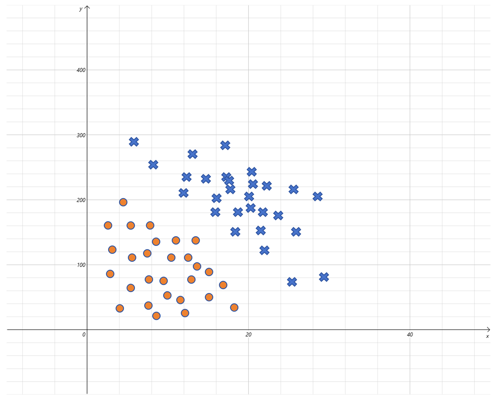
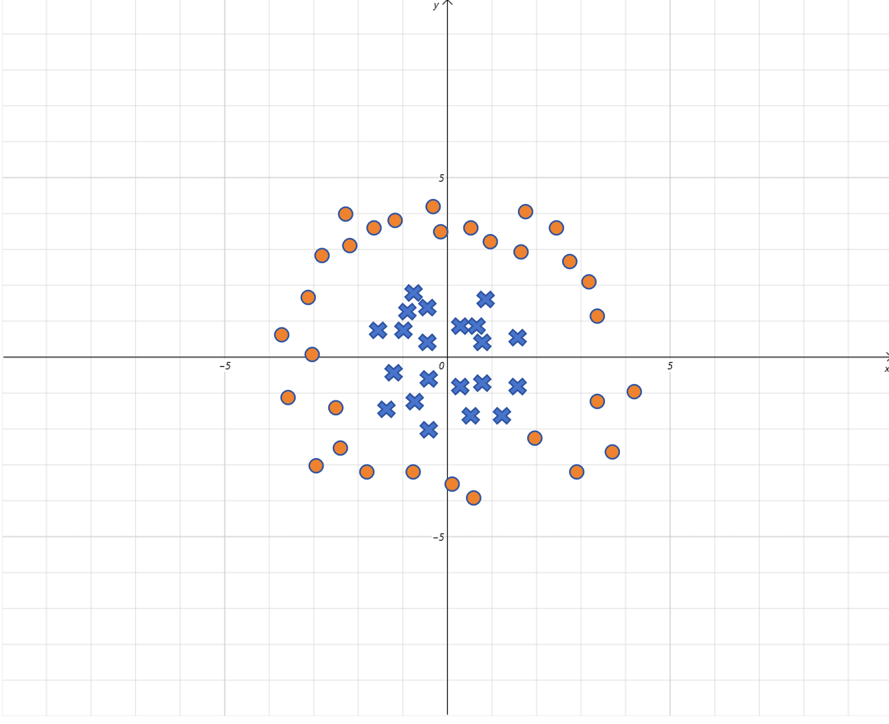
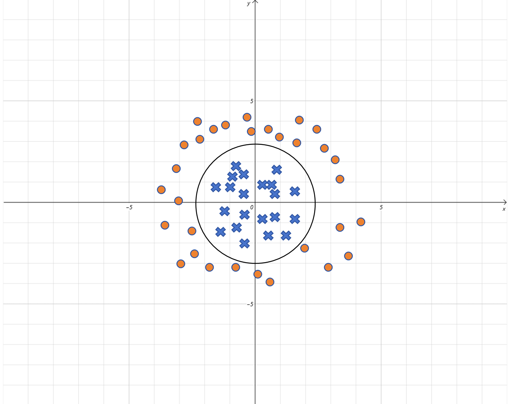

## 1. 逻辑回归 = 线性回归 + Sigmoid

### 1.1 公式层面

$$
\text{LogisticRegression}(x) = \text{Sigmoid}(\text{LinearRegression}(x)) = \frac{1}{1 + e^{-(wx+b)}}
$$

### 1.2 各部分的职责

| 组件 | 做什么 |
|------|--------|
| **线性回归部分**（$wx+b$） | 通过 w 和 b 的线性变换，让**正例的结果 > 0**，**负例的结果 < 0** |
| **Sigmoid 激活函数** | 将 > 0 的值映射到接近 1，< 0 的值映射到接近 0，完成概率化 |

**一句话**：线性回归负责"划线分开"，Sigmoid 负责"变成概率"。

---

## 2. 多元逻辑回归

### 2.1 升级方式

一元变多元，就是把里面的**一元线性回归升级为多元线性回归**，外面照旧套 Sigmoid：

$$
\hat{y} = \text{Sigmoid}(w_1 x_1 + w_2 x_2 + \dots + w_n x_n + b) \newline
$$

$$
= \frac{1}{1 + e^{-(w_1 x_1 + w_2 x_2 + \dots + w_n x_n + b)}}
$$

### 2.2 直观例子：气温 + PM2.5 → 是否出门

现在多了一个特征：不仅看气温，还看 PM2.5。两个特征在二维平面上形成散点，用颜色表示是否出门（0/1）。

模型为：

$$
\hat{y} = \text{Sigmoid}(w_1 x_1 + w_2 x_2 + b)
$$
其中 $x_1$ = 气温，$x_2$ = PM2.5，$w_1, w_2, b$ 是需要训练的参数。

线性部分 $w_1 x_1 + w_2 x_2 + b = 0$​ 在二维平面上代表一条**直线**——这就是逻辑回归的**决策边界**。



---

## 3. 决策边界

### 3.1 什么是决策边界

逻辑回归内部，线性部分等于 0 时，Sigmoid 输出恰好为 0.5（最不确定）。

$$
\text{Sigmoid}(0) = \frac{1}{1 + e^0} = 0.5
$$
所以 **$wx+b=0$ 这条线就是决策边界**：

- $wx+b > 0$ → Sigmoid → 预测 > 0.5 → 判为正例（1）
- $wx+b < 0$ → Sigmoid → 预测 < 0.5 → 判为负例（0）

### 3.2 决策边界一定是直线吗？

默认情况下，$w_1 x_1 + w_2 x_2 + b = 0$ 确实是直线（或高维超平面）。

但如果数据长这样——正例围成一个圆，负例在圆外——直线显然分不开。



### 3.3 通过构造高次项实现曲线决策边界

和线性回归中构造多项式特征的办法一样：给输入增加高次项。

例如增加 $x_1^2$ 和 $x_2^2$：

$$
\hat{y} = \text{Sigmoid}(w_1 x_1^2 + w_2 x_2^2 + b)
$$

假设训练得到 $w_1 = 1, w_2 = 1, b = -4$：

$$
\hat{y} = \text{Sigmoid}(x_1^2 + x_2^2 - 4) = \text{Sigmoid}(x_1^2 + x_2^2 - 2^2)
$$

线性部分 $x_1^2 + x_2^2 - 2^2 = 0$ 就是圆的方程 $x_1^2 + x_2^2 = r^2$（半径 = 2）：

- 点在圆内 → $x_1^2 + x_2^2 - 4 < 0$ → Sigmoid 输出接近 0
- 点在圆外 → $x_1^2 + x_2^2 - 4 > 0$ → Sigmoid 输出接近 1

**决策边界从直线变成了圆。**



以此类推，加入更多高次项，逻辑回归的决策边界理论上可以是**任意形状的曲线**。

---

## 4. 多分类：一对多（One-vs-All）

逻辑回归本身是二分类器。面对多分类（例如 A、B、C、D 四类），最常用的方法是 **一对多（One-vs-All）**。

### 4.1 训练阶段

训练 4 个独立的二分类逻辑回归模型：

| 模型 | 正例 | 负例 |
|------|------|------|
| 模型 A | A（label = 1） | B、C、D（label = 0） |
| 模型 B | B（label = 1） | A、C、D（label = 0） |
| 模型 C | C（label = 1） | A、B、D（label = 0） |
| 模型 D | D（label = 1） | A、B、C（label = 0） |

### 4.2 预测阶段

1. 将样本分别输入 4 个模型，得到 4 个概率值 $P(A), P(B), P(C), P(D)$
2. 取**概率最大的类别**作为最终预测结果

### 4.3 直观理解

每个模型回答一个问题：
- 模型 A："这个样本是 A 的概率有多大？"
- 模型 B："这个样本是 B 的概率有多大？"
- ...

最后选最"自信"的那个答案。

> 除了"一对多"，还有"一对一（One-vs-One）"等方法。但实际中多分类更常用 **Softmax 回归**（逻辑回归的多分类泛化版），这个后面会学到。

---

## 5. 总结

```
                     ┌─ 一元逻辑回归：Sigmoid(wx + b)
                     │
逻辑回归 ─────────────┼─ 多元逻辑回归：Sigmoid(w₁x₁ + w₂x₂ + ... + b)
                     │     └─ 决策边界：w₁x₁ + ... + b = 0（默认是直线/超平面）
                     │     └─ 曲线边界：增加多项式特征（x², x₁x₂ 等）
                     │
                     └─ 多分类扩展：一对多（训练 N 个二分类器，取概率最大者）
```
