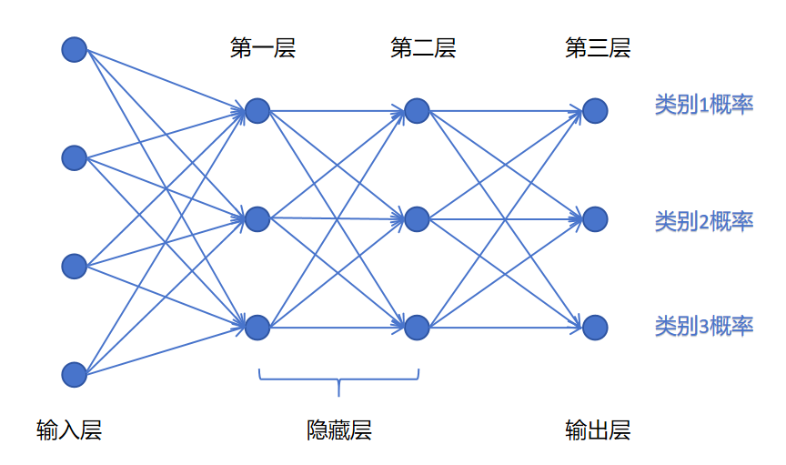
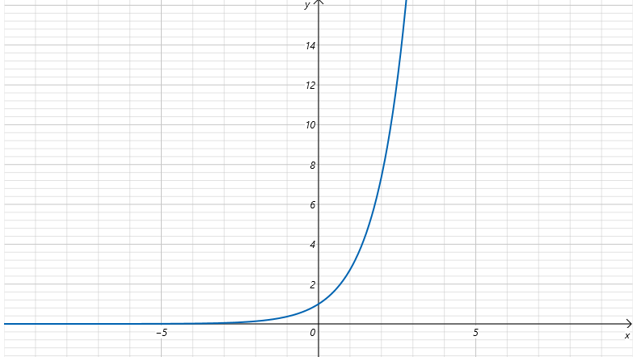

## 1. 改造输出层

逻辑回归做多分类要用"一对多"训练多个模型，麻烦。神经网络可以直接在**一个模型**内完成。

### 做法

- 需要分几类，输出层就设**几个神经元**
- 每个神经元输出一个 [0,1] 的值，代表**样本属于该类别的概率**

例如三分类：


```
输入层 → 隐藏层 → 输出层（3个神经元）
                        ↓
                   [0.05, 0.90, 0.05]  → 属于第 2 类
```

### Logits

输出层经过线性变换、**还没有经过激活函数**的值，称为 **logits**。logits 经过激活函数后才变成最终的概率输出。

---

## 2. Softmax 激活函数

### 2.1 一个朴素想法的问题

想让输出变成概率，最直接的想法：每个神经元的 logits 除以所有 logits 之和。

$$
o_i = \frac{z_i}{z_1 + z_2 + z_3}
$$

**两个问题**：

| 问题 | 原因 |
|------|------|
| 概率可能为负 | logits 有正有负，直接除，负值得到负概率 |
| 不同类别差异是线性的 | [2, 2, 5] 归一化 → [0.22, 0.22, 0.56]，差异不够大，训练慢 |

### 2.2 Softmax 解法

两步：**先取指数，再归一化**。

三分类示例（3 个 logits $z_1, z_2, z_3$，输出概率 $o_1, o_2, o_3$）：

$$
o_1 = \frac{e^{z_1}}{e^{z_1} + e^{z_2} + e^{z_3}} \qquad o_2 = \frac{e^{z_2}}{e^{z_1} + e^{z_2} + e^{z_3}} \qquad o_3 = \frac{e^{z_3}}{e^{z_1} + e^{z_2} + e^{z_3}}
$$

### 2.3 通用公式

$n$ 个类别，第 $i$ 个类别的概率：

$$
o_i = \frac{e^{z_i}}{\sum_{j=1}^{n} e^{z_j}}
$$

### 2.4 Softmax 的两个优势

**优势一：解决负值问题**

$e^x$ 永远是正数 → 所有分子分母为正 → 输出概率永远在 (0, 1) 之间且为正。

**优势二：放大差异，加速训练**

$e^x$ 的指数增长，将微小的 logits 差异**非线性放大**：

| 方法 | [2, 2, 5] 的结果 |
|------|-------------------|
| 直接归一化 | [0.22, 0.22, 0.56] — 差异平缓 |
| Softmax | [0.045, 0.045, 0.909] — **差异明显** |

类别 3 的概率从 0.56 被拉到了 0.91，模型"更自信"了。这有利于梯度更快速地更新参数。

---

## 3. 多分类交叉熵损失

### 3.1 从二分类 BCE 到多分类 CE

二分类 BCE：

$$
\text{BCE} = -[y\log\hat{y} + (1-y)\log(1-\hat{y})]
$$

多分类的交叉熵是它的自然推广。

### 3.2 设定

- 类别数 = $C$
- 真实标签用**独热（one-hot）向量**：$y = (y_1, y_2, \dots, y_C)$，只有真实类别对应位置为 1，其余为 0
- 预测概率分布：$p = (p_1, p_2, \dots, p_C)$，是 Softmax 输出，满足 $\sum p_i = 1$

### 3.3 公式

**单个样本**：

$$
\text{loss} = -\sum_{i=1}^{C} y_i \log(p_i)
$$

由于 one-hot 中只有一个是 1，上式展开后只剩一项：

$$
\text{loss} = -\log(p_y)
$$

其中 $p_y$ 是模型对**真实类别**给出的预测概率。

- $p_y = 1$ → loss = 0（完全正确）
- $p_y \to 0$ → loss $\to +\infty$（完全错误，重罚）

### 3.4 批量样本

batch size = $N$：

$$
\text{loss} = -\frac{1}{N} \sum_{n=1}^{N} \sum_{i=1}^{C} y_i^n \log(p_i^n)$$

---

## 4. 多分类 vs 二分类的输出层设计

| | 输出神经元数 | 激活函数 | 损失函数 |
|------|------|------|------|
| 二分类 | **1 个** | Sigmoid | BCELoss |
| 二分类（备选） | 2 个 | Softmax | CrossEntropyLoss |
| 多分类 | **C 个** | Softmax | CrossEntropyLoss |

二分类也可以用 2 个输出神经元 + Softmax。但实践中更常用 **1 个神经元 + Sigmoid**，参数更少，效率更高。

---

## 5. 总结

```
多分类神经网络的完整数据流：

输入 X
  ↓
隐藏层（线性变换 + ReLU）
  ↓
输出层（线性变换）→ logits（未激活的原始值）
  ↓
Softmax → 概率分布（和 = 1，每项在 (0,1)）
  ↓
CrossEntropyLoss → 与真实 one-hot 标签对比
  ↓
梯度反向传播 → 更新所有层参数

关键理解：
  Softmax 的指数运算 = 解决正负问题 + 放大类间差异
  交叉熵 = 只看真实类别对应的预测概率，越接近 1 越好
```
