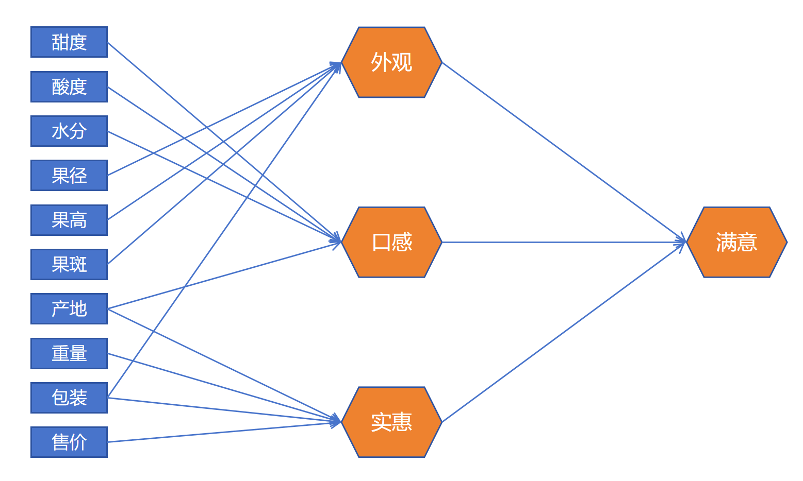
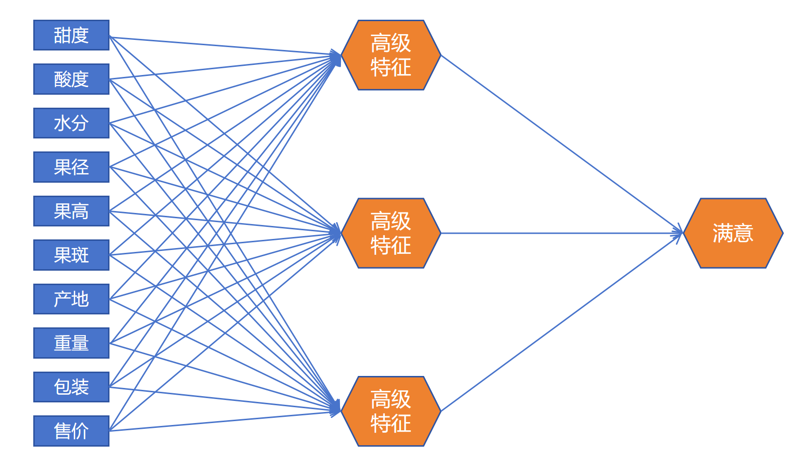

## 1. 一个苹果引发的模型升级

### 1.1 原始数据

预测顾客购买苹果后是否满意（0/1）。收集了 9 个原始特征：

| 特征 | 含义 |
|------|------|
| 甜度、酸度、水分 | 口感相关 |
| 果径、果高、果斑 | 外观相关 |
| 产地、重量、包装、售价 | 实惠相关 |

### 1.2 直接建模（方案一）

把 9 个特征一股脑塞进一个逻辑回归模型：

$$\hat{y} = \text{Sigmoid}(w_1 \cdot \text{甜度} + w_2 \cdot \text{酸度} + \dots + w_9 \cdot \text{售价} + b)$$

**可以用，但不够好。** 有经验的销售人员告诉我们：顾客的满意其实来自三个中间因素——**外观、口感、实惠**。

### 1.3 引入高级特征（方案二）

根据先验知识，构造三层模型：

```
原始特征 ──────────→ 高级特征 ──────────→ 最终判断

果径、果高、果斑、包装  →  外观模型（逻辑回归）
甜度、酸度、水分、产地  →  口感模型（逻辑回归）
产地、重量、包装、售价  →  实惠模型（逻辑回归）
                                      ↓
                        外观、口感、实惠 →  最终满意模型（逻辑回归）
```

一共 **4 个逻辑回归模型**串联，结构上是两层：

- **第一层**：3 个逻辑回归，各自输出一个 [0,1] 值（外观好坏、口感好坏、实惠与否）
- **第二层**：1 个逻辑回归，拿 3 个高级特征做最终判断



---

## 2. 方案二的问题

| 问题 | 说明 |
|------|------|
| **依赖先验知识** | 需要人知道"外观、口感、实惠"这三个中间概念，并且人为决定每个高级特征用哪些原始特征 |
| **需要额外标注** | 需要采集外观、口感、实惠三个中间 label，工作量翻倍 |
| **训练流程割裂** | 必须先分别训练前三个模型，才能训练最终的满意模型，无法端到端训练 |

---

## 3. 三项改进 → 神经网络诞生

### 改进一：不让人类指定高级特征，让模型自己学

不人为定义"外观、口感、实惠"。模型内部自己决定抽象出什么高级特征，人只设计模型结构（比如"我要 3 个高级特征单元"），具体这 3 个单元各自代表什么，模型自己去发现。

### 改进二：所有原始特征接到每个高级特征单元

原来是人工分配——果径只给外观、甜度只给口感。现在**每个高级特征单元都能看到所有 9 个原始特征**，模型通过训练自动学习哪些特征的权重设为 0（不使用），哪些保留。

### 改进三：端到端训练

只提供原始特征 + 最终 label（是否满意），不提供中间 label。整个模型作为一个整体来训练，梯度从最终 loss 一路传到每个参数。



---

## 4. 这就是神经网络

改进后的结构：

```
输入层（9个原始特征）
   │
   ├──────────────────────────────────┐
   │  (每个高级特征单元都能看到全部输入)   │
   ↓                                  ↓
隐藏层（3个逻辑回归单元 = 3个神经元）
   │
   └──→ 输出层（1个逻辑回归单元）
          ↓
     最终预测（0/1）
```

**神经网络 = 多层逻辑回归的组合**。

- 每个**逻辑回归单元**就是后来所说的一个**神经元**
- 图中**高级特征的一层**就是**隐藏层（Hidden Layer）**
- 隐藏层的 3 个单元不是人定义的"外观、口感、实惠"——它们具体代表什么，是模型在训练中自动学出来的，对我们是**黑盒**

### 关键转变

| | 传统方法（方案二） | 神经网络 |
|------|------|------|
| 高级特征由谁定义 | 人（依赖领域经验） | 模型自己学 |
| 中间需要 label 吗 | 需要额外采集 | 不需要 |
| 训练方式 | 分步训练 | **端到端一次性训练** |
| 特征-单元的连接 | 人手动分配 | 模型自动学（不重要就学出权重≈0） |

---

## 5. 总结

```
逻辑回归单元（神经元）
    │
    ├── 多个并排 → 形成一层
    │
    ├── 多层堆叠 → 形成神经网络
    │
    └── 端到端训练 → 中间特征自动学习，无需人工标注

神经网络的核心突破：
  不是"更聪明地建模"，
  而是"让模型自己去学什么是好的中间特征"，
  不再需要人类手工设计特征。
```

这就是从逻辑回归到神经网络的思想跃迁——**从"人类设计特征"到"模型自动发现特征"**。
