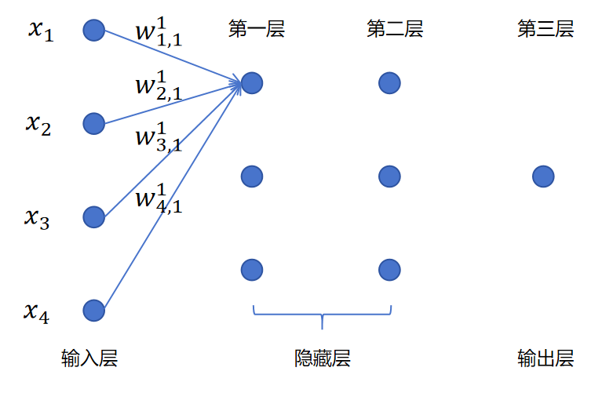

## 1. 权重符号的命名规则

在阅读公式和代码之前，先理清符号约定。

以 $w_{1,1}^{1}$ 为例：

$$
w_{\text{输入序号},\ \text{神经元序号}}^{\text{层号}}
$$

| 符号 | 含义 |
|------|------|
| 上标 **1** | 第一层的参数 |
| 下标 **1, 1** | 第一个 1：针对第 1 个输入的权重；第二个 1：第一层的第 1 个神经元 |

所以：
- $w_{1,1}^{1}$ → 第 1 层、第 1 个神经元、对第 1 个输入特征的权重
- $w_{1,3}^{2}$ → 第 2 层、第 3 个神经元、对第 1 个输入（即上一层第 1 个神经元的输出）的权重

---

## 2. 从逐个计算到矩阵乘法

### 2.1 一个一个算（低效）

一个三层神经网络，输入 4 个特征，第一层 3 个神经元。先看第一个神经元的线性部分（暂不考虑偏置和激活）：


$$
z_1^1 = [x_1, x_2, x_3, x_4] \begin{bmatrix} w_{1,1}^1 \\ w_{2,1}^1 \\ w_{3,1}^1 \\ w_{4,1}^1 \end{bmatrix}
$$

同理，第二个、第三个神经元：

$$
z_2^1 = [x_1, x_2, x_3, x_4] \begin{bmatrix} w_{1,2}^1 \\ w_{2,2}^1 \\ w_{3,2}^1 \\ w_{4,2}^1 \end{bmatrix} \qquad z_3^1 = [x_1, x_2, x_3, x_4] \begin{bmatrix} w_{1,3}^1 \\ w_{2,3}^1 \\ w_{3,3}^1 \\ w_{4,3}^1 \end{bmatrix}
$$

这需要三次独立的向量内积运算。

### 2.2 合并成一次矩阵乘法

把三个神经元的权重拼成一个矩阵：

$$
z^1 = [z_1^1, z_2^1, z_3^1] = [x_1, x_2, x_3, x_4] \begin{bmatrix} w_{1,1}^1 & w_{1,2}^1 & w_{1,3}^1 \\ w_{2,1}^1 & w_{2,2}^1 & w_{2,3}^1 \\ w_{3,1}^1 & w_{3,2}^1 & w_{3,3}^1 \\ w_{4,1}^1 & w_{4,2}^1 & w_{4,3}^1 \end{bmatrix}
$$

**一次矩阵乘法，算出整层的输出。** 形状：$(1 \times 4) \times (4 \times 3) = (1 \times 3)$。

### 2.3 进一步：多个样本一起算

一个样本是行向量 × 权重矩阵。把多个样本叠成矩阵，一次乘法处理整个 batch：

$$
\begin{bmatrix} x_{11} & x_{12} & x_{13} & x_{14} \\ x_{21} & x_{22} & x_{23} & x_{24} \end{bmatrix} \begin{bmatrix} w_{1,1}^1 & w_{1,2}^1 & w_{1,3}^1 \\ w_{2,1}^1 & w_{2,2}^1 & w_{2,3}^1 \\ w_{3,1}^1 & w_{3,2}^1 & w_{3,3}^1 \\ w_{4,1}^1 & w_{4,2}^1 & w_{4,3}^1 \end{bmatrix}
$$

形状：$(N \times 4) \times (4 \times 3) = (N \times 3)$，N 个样本一次算完。

---

## 3. 完整的一层计算流程

每一层的前向传播，就是三个步骤：

```
1. 矩阵乘法    z = X @ W          (输入 × 权重矩阵)
2. 加偏置       z = z + b          (广播加法)
3. 激活函数    a = σ(z)           (逐元素应用 Sigmoid)
```

### 具体到第一层

$$
z^1 = X W^1 \quad \rightarrow \quad z^1 = z^1 + b^1 \quad \rightarrow \quad a^1 = \text{Sigmoid}(z^1)
$$

### 第二层同理

$a^1$ 成为第二层的输入：

$$
z^2 = a^1 W^2 \quad \rightarrow \quad z^2 = z^2 + b^2 \quad \rightarrow \quad a^2 = \text{Sigmoid}(z^2)
$$

### 推广到任意层 $l$

$$
a^l = \sigma(a^{l-1} \cdot W^l + b^l)
$$

其中 $a^{l-1}$ 是上一层的输出（第一层时 $a^0 = X$）。

---

## 4. 反向传播也可以用矩阵加速

前向传播全部是矩阵运算，反向传播计算梯度时，同样可以表达为矩阵运算（转置乘法等），同样可以被 GPU 并行加速。反向传播的矩阵形式后续会详细讲解。

---

## 5. 为什么 GPU 适合矩阵运算

### 5.1 CPU vs GPU

| | CPU | GPU |
|------|-----|-----|
| 核心数 | 几个 ~ 几十个（强单核） | **上千个**（弱单核、强并行） |
| 擅长 | 复杂逻辑、分支预测 | **大量简单重复运算** |
| 类比 | 一个数学教授 | 一千个小学生同时做加法 |

### 5.2 矩阵乘法天然可并行

矩阵乘法本质就是**大量互不依赖的乘法和加法**。每个结果元素可以由不同 GPU 核心独立计算，彼此无需等待。

$$C[i,j] = \sum_k A[i,k] \times B[k,j]$$

每个 $(i,j)$ 位置的计算，都可以分给一个独立的 GPU 线程。

### 5.3 GPU 的历史加成

- GPU 最初为**图像处理**设计 — 图像本身就是像素的二维矩阵
- GPU 天生就针对矩阵、向量运算做了硬件优化
- AI 兴起后，NVIDIA 又专门加入了 **Tensor Core** — 专为矩阵乘法设计的硬件单元，进一步大幅提升神经网络训练速度

---

## 6. 总结

```
神经网络的"基因优势"：所有计算都可以表达为矩阵运算

逐神经元计算（循环 for 循环）
    ↓ 合并权重为矩阵
一层一次矩阵乘法（X @ W）
    ↓ 叠多个样本
一个 batch 一次矩阵乘法
    ↓ GPU 上千核心并行
极速训练

每一层前向传播 = 矩阵乘法 + 加偏置 + 激活函数
反向传播同样可以矩阵化 → GPU 统一加速
```

神经网络能成为主流，不仅因为模型设计好，更因为它**天然适配矩阵运算 + GPU 硬件**，两者结合才释放了全部潜力。
