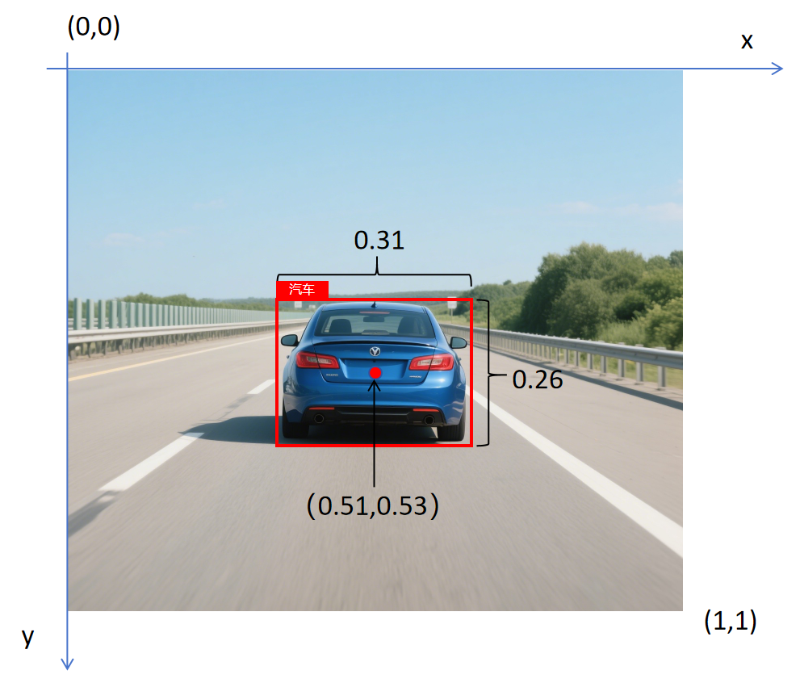
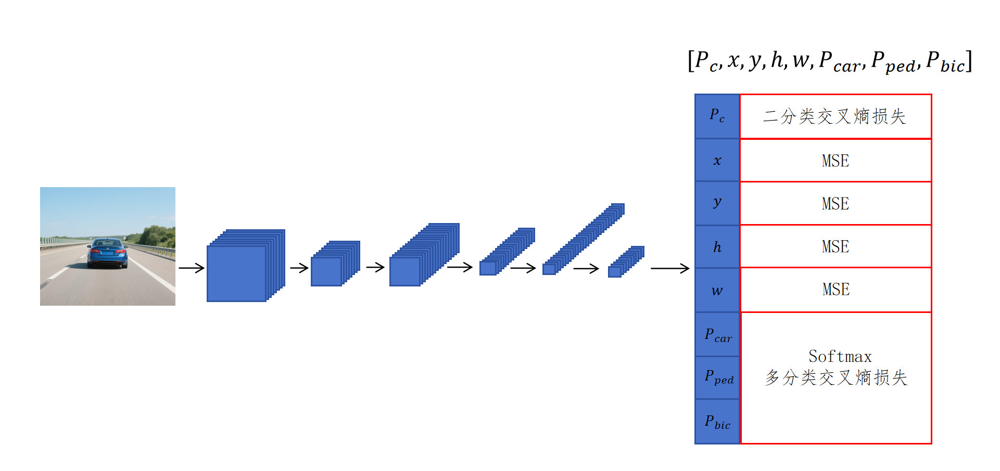
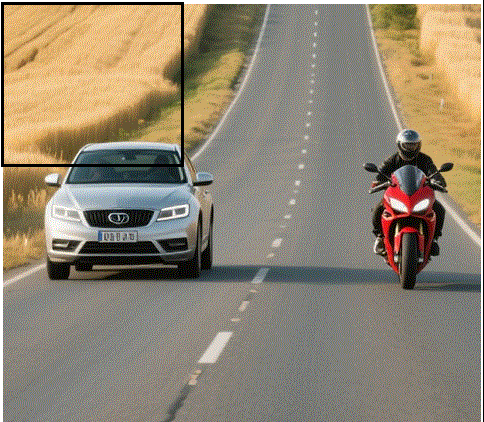
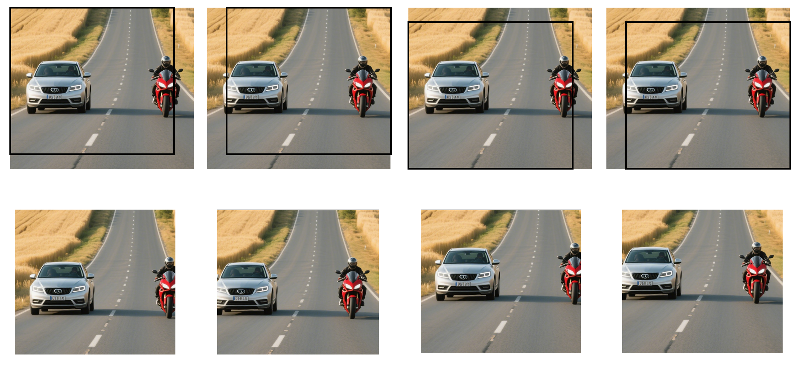
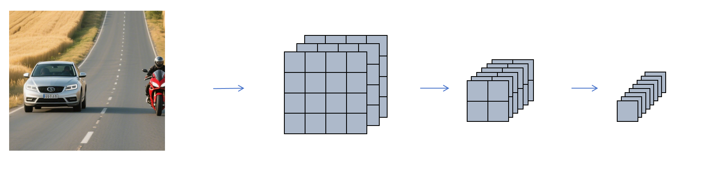
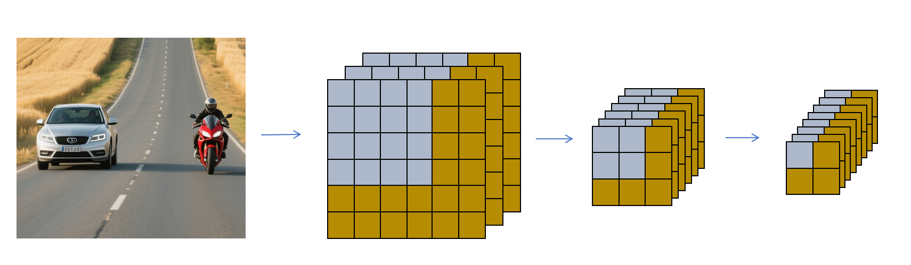

## 1. 目标检测 vs 图像分类

| 任务 | 回答什么 |
|------|---------|
| 图像分类 | 图里**是什么** |
| 目标检测 | 图里**有哪些物体 + 它们在哪 + 多大** |

应用：自动驾驶识别马路上所有目标及其位置。

---

## 2. 分类 + 定位（单目标）

### 2.1 边界框（Bounding Box）

标注时用框框出目标，用 4 个数字表示位置和大小：

$$
\text{中心点}(x, y) + \text{高} h + \text{宽} w
$$

- 原点在图片**左上角** (0,0)，右下角 (1,1)，坐标归一化
- 例：汽车中心 (0.51, 0.53)，高 0.26，宽 0.31



### 2.2 Ground Truth 标注格式（8 个元素）

$$
[P_c,\ x,\ y,\ h,\ w,\ P_{car},\ P_{ped},\ P_{bic}]
$$

| 元素 | 含义 |
|------|------|
| $P_c$ | 图里是否有目标（0/1） |
| $x,y,h,w$ | 边界框位置和大小 |
| $P_{car}, P_{ped}, P_{bic}$ | 是哪类目标（one-hot） |

例：`[1, 0.51, 0.53, 0.26, 0.31, 1, 0, 0]`（一辆汽车）



### 2.3 网络改造与损失函数

输出层从 3 个神经元改为 **8 个**，每个对应一个元素。损失分三部分：

| 部分 | 激活函数 | 损失函数 |
|------|---------|---------|
| $P_c$（是否有目标） | Sigmoid | 二分类交叉熵 |
| $x,y,h,w$（位置） | —（线性） | MSE |
| $P_{car},P_{ped},P_{bic}$（类别） | Softmax | 多分类交叉熵 |

### 2.4 总 loss 分两种情况

```
Pc = 0（图里没目标）：
  loss = 只算 Pc 的二分类损失
  （忽略边界框和类别的损失）

Pc = 1（有目标）：
  loss = 8 个元素所有损失相加
```

> 关键启示：卷积神经网络不仅能分类，也能做回归；多目标任务的 loss 可以拆成多个子 loss 相加。

---

## 3. 滑动窗口法（多目标）

图片里有多个目标怎么办？



**滑动窗口**：定义不同大小的窗口在图上滑动，每次截取一块交给 CNN 分类定位。

| 参数 | 影响 |
|------|------|
| 窗口大小 | 需多种大小适应不同尺寸目标 |
| 步长 | 太小→截取多、检测慢；太大→可能截不到完整目标 |

---

## 4. 卷积共享：避免重复计算

滑动窗口的截取图有大量重叠，每次都独立跑 CNN 是巨大浪费。





**改进**：对**整张原图**做一次完整卷积，得到一个大的特征图。



```
滑动窗口法：4 个窗口 → 分别卷积 → 4 个 1×1×8 特征
卷积共享：  原图 1 次卷积 → 1 个 2×2×8 特征图
              ↑ 2×2 正好对应 4 个窗口位置
```

一次卷积搞定所有窗口，计算量大幅下降。

---

## 5. 两大流派

### 5.1 R-CNN 系列（两阶段，精度高，速度慢）

```
第一阶段：找出目标可能存在的候选区域（Region Proposal）
第二阶段：对候选区域做分类和定位
```

### 5.2 YOLO 系列（端到端，速度快，实时）

**You Only Look Once** —— 只看一次。

```
把图片划分成 S×S 个 cell（如 3×3 或实际 13×13）
CNN 输出 S×S×(5+C) 的特征图
  5 = 4 个位置 + 1 个是否有目标标志
  C = 类别数（如 1000）
目标中心点落在哪个 cell，就由哪个 cell 负责预测
```

| | R-CNN | YOLO |
|------|-------|------|
| 阶段 | 两阶段 | 单阶段（端到端） |
| 速度 | 慢 | **快、实时** |
| 精度 | 高 | 略低 |

---

## 6. 总结

```
目标检测 = 分类 + 定位（+ 多目标）

单目标：
  Ground Truth = [Pc, x, y, h, w, 类别one-hot]
  loss = Pc的二分类 + 位置的MSE + 类别的多分类CE

多目标：
  滑动窗口（慢但有重叠浪费）
  → 卷积共享：整图一次卷积，特征图对应所有窗口

两大流派：
  R-CNN：两阶段，候选区域 + 分类定位（精但慢）
  YOLO：单阶段，划分 cell 一次预测（快、实时）

还有更多问题（一个 cell 多目标、多 cell 同目标、目标尺度差异大）
  → 专门的教程再深入
```
