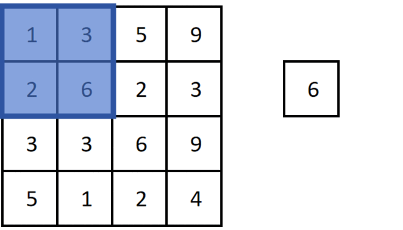

## 1. 最大池化（Max Pooling）

### 1.1 操作过程

对一个 4×4 特征图，池化窗口 2×2、步长 2：

- 每个 2×2 窗口内取**最大值**作为输出
- 4×4 的特征图 → 2×2 的输出特征图



### 1.2 特点

- 无需要学习的参数
- 极其简单、计算高效

---

## 2. 池化的三大作用

| 作用 | 说明 |
|------|------|
| **减小特征图** | 长宽减半，降低后续计算量 |
| **过滤干扰信息** | 只保留窗口内最强激活值，忽略次要信号 |
| **小范围平移不变性** | 最大特征出现在窗口内任意位置，输出都一样 |

池化层一般跟在卷积层后，构成一个"卷积 → 池化"的特征提取模块，CNN 里可以有多个这样的模块。

---

## 3. 池化层的配置

最常见配置：

```
池化窗口：2×2
步长：2（与窗口等大，无重叠）
Padding：0（不用填充，本意就是缩小）
```

**效果**：输出特征图的长宽 = 输入的一半。

为什么步长 = 窗口大小？这样每次池化互不重叠，最大程度减小尺寸。

---

## 4. 多通道池化：逐通道独立进行

**池化不改变通道数**（和卷积不同！）

```
输入：H × W × C
池化：每个通道独立做 2×2 max pooling
输出：(H/2) × (W/2) × C   ← 通道数不变
```

### 为什么池化不融合通道？

| | 卷积 | 池化 |
|------|------|------|
| 可学习参数 | 有 | **无** |
| 多通道处理 | 融合（各通道加权求和） | 独立（各通道分别取 max） |
| 输出通道数 | 由 Filter 个数决定 | **等于输入通道数** |

- 卷积有参数，可以把"颜色通道 + 形状通道"融合成"苹果"这个新特征
- 池化没有参数，无法融合；且不同通道的特征（如颜色 vs 形状）**没有可比性**，跨通道取最大值无意义

---

## 5. 池化 vs 卷积（都能缩小尺寸）

卷积层设置 stride>1 也能缩小特征图，那还要池化干什么？

| | 卷积层 | 池化层 |
|------|------|------|
| 可学习参数 | 有（$K^2 + 1$ 个） | **无（0 个）** |
| 运算成本 | 高 | **极低** |
| 作用 | 融合多通道，生成新特征 | 只保留最强特征，消除其他 |

池化是"零成本"的尺寸缩小手段。

---

## 6. 平均池化（Average Pooling）

与最大池化取最大值不同，平均池化取窗口内所有值的**平均值**。

| | 最大池化 | 平均池化 |
|------|---------|---------|
| 输出 | 窗口最大值 | 窗口平均值 |
| 特点 | 聚焦关键特征 | 平滑局部特征 |
| 适用 | 图像分类 | 去噪、建模全局信息 |

最常用的是**全局平均池化（Global Average Pooling）**——对整个特征图取平均，输出一个值，后文会介绍。

---

## 7. 下采样与上采样

| 术语 | 方向 | 作用 | 例子 |
|------|------|------|------|
| **下采样（Downsampling）** | 大 → 小 | 降低分辨率 | 池化层 |
| **上采样（Upsampling）** | 小 → 大 | 提高分辨率 | 后文会讲（反卷积、插值等） |

---

## 8. 总结

```
池化层 = 无参数的下采样操作

最大池化：
  每个 2×2 窗口取最大值 → 长宽减半
  作用：缩小特征图 + 过滤干扰 + 小范围平移不变性

配置惯例：
  窗口 2×2，步长 2，无 Padding，通道数不变

与卷积的区别：
  卷积：有参数，融合多通道，生成新特征
  池化：无参数，逐通道独立，只保留最强特征

最大池化 → 分类；平均池化 → 平滑/全局信息
```
