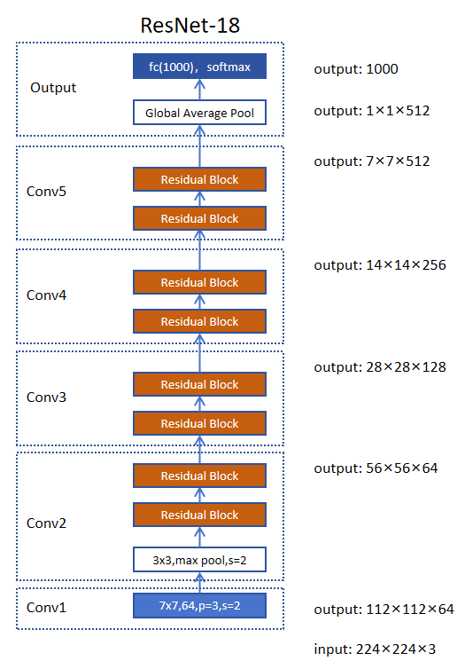
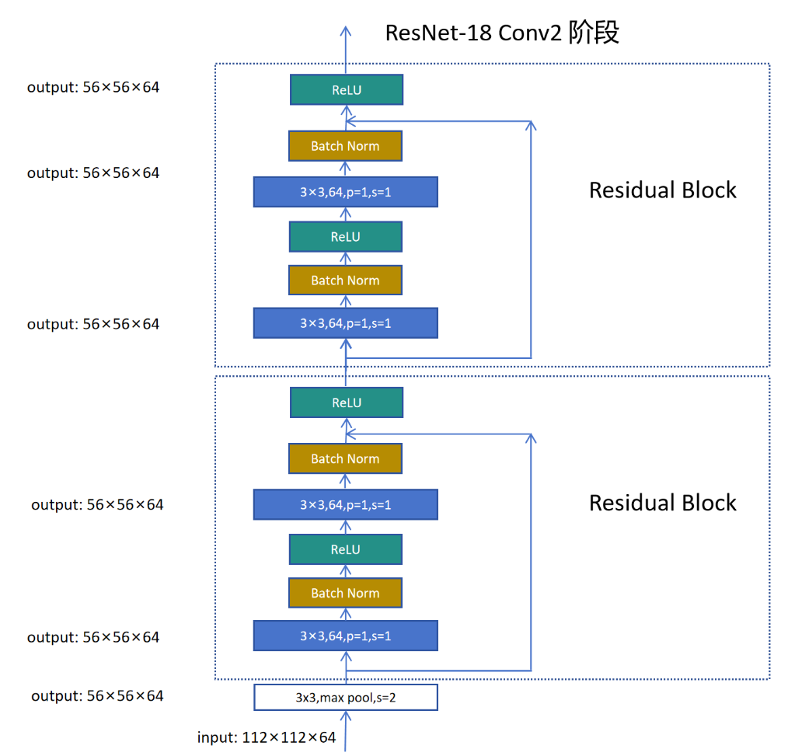
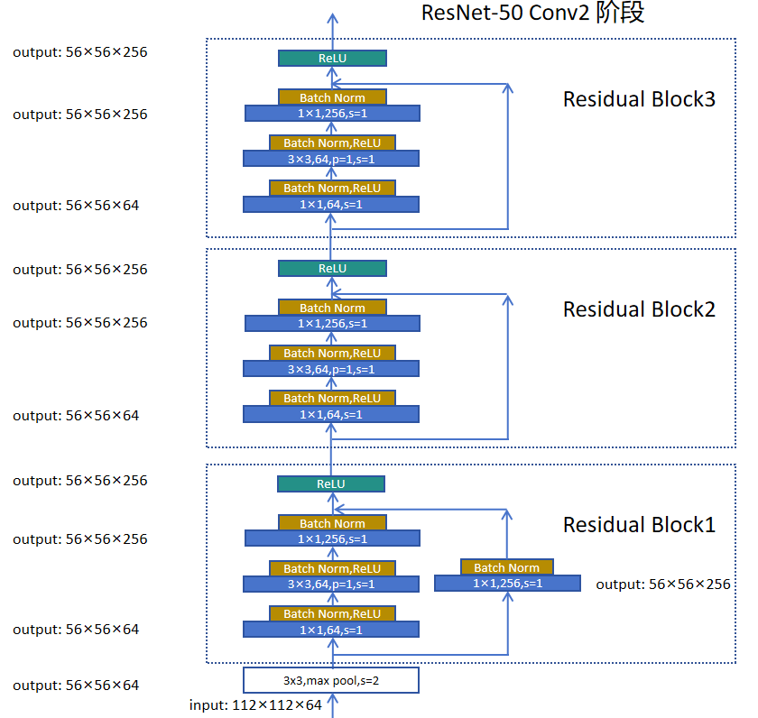

## 1. ResNet 整体架构（6 个阶段）

```
Conv1 → Conv2 → Conv3 → Conv4 → Conv5 → Output
```

| 阶段 | 内容 | 说明 |
|------|------|------|
| **Conv1** | 7×7 卷积, stride=2 | 224→112，通道 3→64 |
| **Conv2** | 若干残差块 | 用 MaxPool 减半尺寸 |
| **Conv3~5** | 若干残差块 | 用 stride=2 卷积减半尺寸 |
| **Output** | 全局平均池化 + FC + Softmax | 分类 |



**规律**：每个阶段特征图高宽减半、通道数翻倍。

### 各版本对比

| 版本 | 残差块类型 | 每个阶段的块数 [Conv2,Conv3,Conv4,Conv5] |
|------|-----------|----------------------------------------|
| ResNet-18 | BasicBlock | [2, 2, 2, 2] |
| ResNet-34 | BasicBlock | [3, 4, 6, 3] |
| ResNet-50 | Bottleneck | [3, 4, 6, 3] |
| ResNet-101 | Bottleneck | [3, 4, 23, 3] |
| ResNet-152 | Bottleneck | [3, 8, 36, 3] |

---

## 2. 两种残差块

| | BasicBlock | Bottleneck |
|------|-----------|-----------|
| 结构 | 3×3 → 3×3 | 1×1 → 3×3 → 1×1 |
| 用于 | ResNet-18/34 | ResNet-50/101/152 |
| 特点 | 简单 | 先降维再恢复，**大幅减少计算量** |

---

## 3. BasicBlock 详解



```
输入 x
  ├── 3×3 卷积 → BN → ReLU → 3×3 卷积 → BN  ────┐
  │                                            ↓
  └── (捷径，必要时 1×1 卷积调整) ──→ 相加 → ReLU → 输出
```

### 3.1 关键细节

| 细节 | 说明 |
|------|------|
| **第一个残差块可能改变尺寸** | Conv3~5 的第一个块，第一个 3×3 卷积用 stride=2 实现"高宽减半+通道翻倍" |
| **后续块保持尺寸** | 其余 3×3 卷积 stride=1，尺寸不变 |
| **捷径连接** | 尺寸一致时直接相加；不一致时用 **1×1 stride=2** 卷积调整 |
| **BN 按通道进行** | 每个通道代表不同特征，BN 在"batch × 高 × 宽"上算均值和方差 |

### 3.2 为什么捷径用 1×1 stride=2 卷积

尺寸不一致时，捷径必须把特征图也变成"高宽减半、通道翻倍"才能相加。1×1 stride=2 卷积是达到这个目的**计算量最小**的方式。虽然会丢信息（stride=2 跳过部分特征），但主要信息靠主通道传递。

---

## 4. Bottleneck 详解



```
输入 x
  ├── 1×1 降维 → 3×3 卷积 → 1×1 升维 → BN ──┐
  │                                           ↓
  └── (捷径) ──────────────────→ 相加 → ReLU → 输出
```

### 4.1 为什么叫 Bottleneck（瓶颈）

| 步骤 | 通道变化 | 作用 |
|------|---------|------|
| 1×1 卷积 | 256 → 64 | **降维**（瓶颈） |
| 3×3 卷积 | 64 → 64 | 在低维上做卷积，计算量小 |
| 1×1 卷积 | 64 → 256 | **恢复**维度 |

先降到 64 通道做卷积，再升回 256。因为 3×3 卷积在低维上跑，计算量大幅下降。

### 4.2 效果

ResNet-50 的计算量几乎和 ResNet-34 相当，但深度多了 16 层。

---

## 5. 完整代码

### 5.1 BasicBlock

```python
class BasicBlock(nn.Module):
    expansion = 1

    def __init__(self, in_channels, out_channels, stride=1, downsample=None):
        super(BasicBlock, self).__init__()
        self.conv1 = nn.Conv2d(in_channels, out_channels, kernel_size=3,
                               stride=stride, padding=1, bias=False)
        self.bn1 = nn.BatchNorm2d(out_channels)
        self.relu = nn.ReLU(inplace=True)
        self.conv2 = nn.Conv2d(out_channels, out_channels, kernel_size=3,
                               stride=1, padding=1, bias=False)
        self.bn2 = nn.BatchNorm2d(out_channels)
        self.downsample = downsample

    def forward(self, x):
        identity = x
        out = self.conv1(x)
        out = self.bn1(out)
        out = self.relu(out)
        out = self.conv2(out)
        out = self.bn2(out)
        if self.downsample is not None:
            identity = self.downsample(x)
        out += identity
        out = self.relu(out)
        return out
```

### 5.2 Bottleneck

```python
class Bottleneck(nn.Module):
    expansion = 4

    def __init__(self, in_channels, out_channels, stride=1, downsample=None):
        super(Bottleneck, self).__init__()
        self.conv1 = nn.Conv2d(in_channels, out_channels, kernel_size=1, bias=False)
        self.bn1 = nn.BatchNorm2d(out_channels)
        self.conv2 = nn.Conv2d(out_channels, out_channels, kernel_size=3,
                               stride=stride, padding=1, bias=False)
        self.bn2 = nn.BatchNorm2d(out_channels)
        self.conv3 = nn.Conv2d(out_channels, out_channels * self.expansion,
                               kernel_size=1, bias=False)
        self.bn3 = nn.BatchNorm2d(out_channels * self.expansion)
        self.relu = nn.ReLU(inplace=True)
        self.downsample = downsample

    def forward(self, x):
        identity = x
        out = self.conv1(x)
        out = self.bn1(out)
        out = self.relu(out)
        out = self.conv2(out)
        out = self.bn2(out)
        out = self.relu(out)
        out = self.conv3(out)
        out = self.bn3(out)
        if self.downsample is not None:
            identity = self.downsample(x)
        out += identity
        out = self.relu(out)
        return out
```

### 5.3 ResNet 主类

```python
class ResNet(nn.Module):
    def __init__(self, block, layers, num_classes=1000):
        super(ResNet, self).__init__()
        self.in_channels = 64
        self.conv1 = nn.Conv2d(3, 64, kernel_size=7, stride=2, padding=3, bias=False)
        self.bn1 = nn.BatchNorm2d(64)
        self.relu = nn.ReLU(inplace=True)
        self.maxpool = nn.MaxPool2d(kernel_size=3, stride=2, padding=1)
        self.layer1 = self._make_layer(block, 64, layers[0])
        self.layer2 = self._make_layer(block, 128, layers[1], stride=2)
        self.layer3 = self._make_layer(block, 256, layers[2], stride=2)
        self.layer4 = self._make_layer(block, 512, layers[3], stride=2)
        self.avgpool = nn.AdaptiveAvgPool2d((1, 1))
        self.fc = nn.Linear(512 * block.expansion, num_classes)

    def _make_layer(self, block, out_channels, blocks, stride=1):
        downsample = None
        if stride != 1 or self.in_channels != out_channels * block.expansion:
            downsample = nn.Sequential(
                nn.Conv2d(self.in_channels, out_channels * block.expansion,
                          kernel_size=1, stride=stride, bias=False),
                nn.BatchNorm2d(out_channels * block.expansion),
            )
        layers = [block(self.in_channels, out_channels, stride, downsample)]
        self.in_channels = out_channels * block.expansion
        for _ in range(1, blocks):
            layers.append(block(self.in_channels, out_channels))
        return nn.Sequential(*layers)

    def forward(self, x):
        x = self.conv1(x)
        x = self.bn1(x)
        x = self.relu(x)
        x = self.maxpool(x)
        x = self.layer1(x)
        x = self.layer2(x)
        x = self.layer3(x)
        x = self.layer4(x)
        x = self.avgpool(x)
        x = torch.flatten(x, 1)
        x = self.fc(x)
        return x


def res_net50(num_classes=1000):
    return ResNet(Bottleneck, [3, 4, 6, 3], num_classes=num_classes)

def res_net18(num_classes=1000):
    return ResNet(BasicBlock, [2, 2, 2, 2], num_classes=num_classes)
```

---

## 6. 关键实现要点

| 要点 | 说明 |
|------|------|
| `bias=False` | 卷积后接 BN，bias 被 BN 抵消，所以卷积层不加 bias |
| `downsample` | 尺寸/通道不一致时，捷径用 1×1 stride=2 卷积调整 |
| `expansion` | BasicBlock=1，Bottleneck=4（输出通道是中间通道的 4 倍） |
| `_make_layer` | 判断是否需要 downsample，然后循环构造残差块 |
| `AdaptiveAvgPool2d((1,1))` | 自适应全局平均池化，支持任意输入尺寸 |

---

## 7. 总结

```
ResNet 实现两大核心：

BasicBlock（ResNet-18/34）：
  3×3 → BN → ReLU → 3×3 → BN → 加捷径 → ReLU

Bottleneck（ResNet-50/101/152）：
  1×1 降维 → 3×3 → 1×1 升维 → 加捷径 → ReLU
  （降维后卷积，计算量大幅下降）

捷径连接：
  尺寸一致 → 直接相加
  尺寸不一致 → 1×1 stride=2 卷积调整

关键细节：
  conv 用 bias=False（后面有 BN）
  BN 按通道进行
  输出用 AdaptiveAvgPool + FC
```
