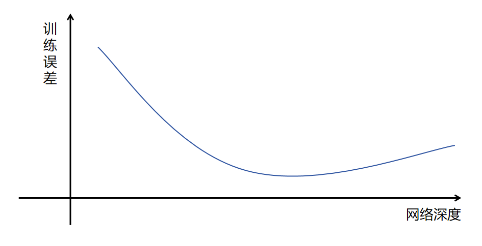
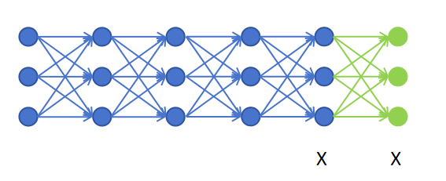
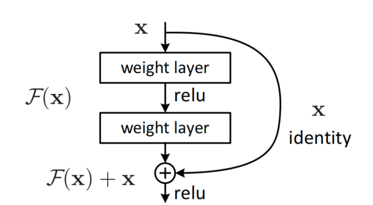

## 1. ResNet 的里程碑

| 项目 | 信息 |
|------|------|
| 提出者 | 何恺明等，2015 年 |
| 成绩 | ILSVRC 2015 冠军，Top-5 错误率 **3.57%** |
| 意义 | 首次显著超越人类水平（5.1%） |

在 ResNet 之前 CNN 只能到 ~30 层，有了残差连接后可以到 100 多层甚至 1000 层。

---

## 2. 网络越深越好吗？—— 退化问题

之前认为：同样的参数量，网络越深性能越好（逐层抽象特征）。

**但实验发现**：网络到一定深度后，随着深度增加，**训练误差反而上升**。



| | 过拟合 | 退化问题 |
|------|--------|---------|
| 训练误差 | 小 | **大**（上升） |
| 测试误差 | 大 | 大 |
| 原因 | 记住了噪声 | 深层网络难以优化 |

实验：20 层网络 vs 56 层网络，20 层的训练和测试错误率**都**更低。

---

## 3. 恒等映射：理论上能解，实际上学不到

### 3.1 理想情况

假设已有网络达到最优，再增加一层。理论上新层只要学一个**恒等映射**（输入 X，输出还是 X），Loss 就不会增加。



### 3.2 为什么学不到恒等映射

- 所有层**一起训练**，网络无法"规划"哪些层学特征、哪些层做恒等映射
- 网络变深 → 浅层梯度经过更多连乘 → 梯度极小 → 监督信号弱
- 浅层提取的特征质量下降 → 训练误差不降反升

---

## 4. 残差连接：让恒等映射变容易

### 4.1 核心思想

普通网络：学 $H(x)$（输入 x 的完整映射）

ResNet：把输出拆成两部分

$$
H(x) = F(x) + x
$$

- $x$：输入本身（恒等部分）
- $F(x)$：新增层对 x 做的**修改**（残差部分）

### 4.2 残差块结构

```
输入 x
  ├── 捷径连接（shortcut）────────────┐
  │                                  ↓
  └── 权重层 → 权重层 → F(x) ──→  F(x) + x → 激活
```



- **残差块**：跳过两层，x 绕过权重层直达输出的结构
- **捷径连接（shortcut connection）**：x 绕过层的这条路径

### 4.3 为什么更容易学恒等映射

如果这层没用，模型只需把 $F(x)$ 学成 0，输出就是 $x$（恒等映射）。

**把"学习恒等映射"变成了"学习零映射"** —— 后者简单得多（把权重学成 0 即可）。

---

## 5. 残差连接的第二个好处：梯度直达浅层

```
普通网络：梯度层层传递 → 连乘 → 越往前越弱（梯度消失）
残差网络：梯度走捷径连接直达浅层 → 监督信号强
```

实验结果：

| 网络 | 18 层错误率 | 34 层错误率 |
|------|------------|------------|
| 普通 CNN | 低 | **更高**（退化） |
| ResNet | 低 | **更低**（越深越好） |

---

## 6. 总结

```
问题：网络深了训练误差反而上升（退化问题，非过拟合）
根源：恒等映射难以学习 + 梯度连乘导致浅层监督信号弱

ResNet 解法：残差连接
  H(x) = F(x) + x
  ├── 学"修改"F(x) 而非"完整映射"H(x)
  ├── 学恒等映射 → 学零映射（简单得多）
  └── 捷径连接让梯度直达浅层

效果：
  CNN 从 ~30 层 → 100+ 层甚至 1000 层
  Top-5 错误率 3.57%，超越人类水平
```
