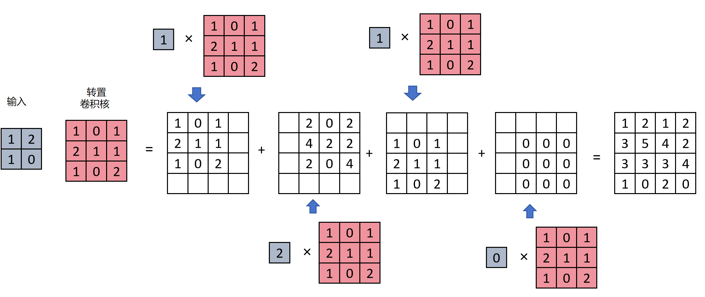
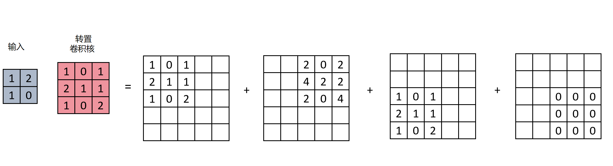
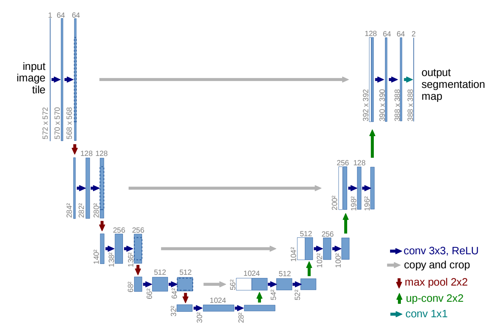

## 1. 语义分割是什么

| 任务 | 输出粒度 |
|------|---------|
| 图像分类 | 整张图一个类别 |
| 目标检测 | 目标的边界框 |
| **语义分割** | **每个像素一个类别** |

应用：人像抠图虚化背景、遥感照片识别森林面积（不规则形状）。

---

## 2. 语义分割的原理

**本质：对每个像素做多分类。**

以 4 类（背景、行人、汽车、摩托车）为例：

```
输入：224×224×3
  ↓ 语义分割网络
输出：224×224×4   ← 高宽不变，通道数 = 类别数
  ↓ 每个像素的 4 个特征做 Softmax
每个像素的分类结果
```

### 主流架构：下采样 + 上采样

```
输入 → 卷积下采样（提取高级语义特征）→ 转置卷积上采样（恢复原尺寸）→ 逐像素分类
```

---

## 3. 转置卷积（Transposed Convolution）

### 3.1 作用：放大特征图

普通卷积（不 padding）会让特征图变小，转置卷积则相反——**放大特征图**。



### 3.2 计算过程（2×2 → 4×4）

```
输入 2×2，卷积核 3×3，步长 1

对输入每个元素：
  取出元素 × 卷积核 → 得到一个 3×3 矩阵
  按步长摆放到输出相应位置
最后把所有矩阵相加 → 4×4 输出
```

- 步长 2 时，各矩阵之间留出间隔



- 卷积核参数在**训练中学习**——模型学会如何上采样才能保留语义信息

---

## 4. U-Net：编码器-解码器 + 跳跃连接



### 4.1 三部分结构

```
编码器（Encoder）→ 解码器（Decoder）
        ↓ 跳跃连接（Skip Connections）↑
```

| 部分 | 别名 | 作用 |
|------|------|------|
| **编码器** | 收缩路径 | 卷积+池化，逐步下采样，提取深层语义信息 |
| **解码器** | 扩展路径 | 上采样+卷积，逐步恢复空间分辨率 |
| **跳跃连接** | Skip Connections | 把编码器对应层的特征图拼接到解码器 |

### 4.2 跳跃连接：U-Net 的核心创新

下采样会丢失空间细节信息。跳跃连接把**编码器低层的特征图**直接拼接到**解码器对应层**：

```python
u6 = torch.cat([c4, u6], dim=1)  # 编码器 c4 拼到解码器 u6
```

- 保留了低层的空间细节
- 让网络既能"看得懂"（高层语义），又能"看得清"（低层细节）

### 4.3 输出

最后一层 1×1 卷积把多通道映射为类别数通道，再 Softmax 做像素级分类。

> 注意：原论文跳跃连接时两边特征图尺寸不一致（3×3 卷积没加 Padding），需裁剪。现在实现普遍用 `padding=1` 保证尺寸一致，省去裁剪。

---

## 5. U-Net 实现要点

### 5.1 DoubleConv（基本单元）

```python
class DoubleConv(nn.Module):
    """两个连续的 3×3 Conv(padding=1) + BN + ReLU"""
    def __init__(self, in_ch, out_ch):
        super().__init__()
        self.double_conv = nn.Sequential(
            nn.Conv2d(in_ch, out_ch, kernel_size=3, padding=1, bias=False),
            nn.BatchNorm2d(out_ch),
            nn.ReLU(inplace=True),
            nn.Conv2d(out_ch, out_ch, kernel_size=3, padding=1, bias=False),
            nn.BatchNorm2d(out_ch),
            nn.ReLU(inplace=True),
        )
```

### 5.2 关键设计

| 组件 | 实现 |
|------|------|
| 下采样 | `MaxPool2d(2)` 减半 |
| 上采样 | `ConvTranspose2d(kernel_size=2, stride=2)` 放大 ×2 |
| 跳跃连接 | `torch.cat([编码器特征, 解码器特征], dim=1)` |
| 输出 | `Conv2d(64, out_ch, kernel_size=1)` |

### 5.3 通道数变化规律

```
编码器：64 → 128 → 256 → 512 → 1024（通道翻倍，尺寸减半）
解码器：1024 → 512 → 256 → 128 → 64（通道减半，尺寸翻倍）
```

---

## 6. 总结

```
语义分割 = 对每个像素做分类

输入 H×W×3 → 输出 H×W×C（C = 类别数）
每个像素的 C 个特征做 Softmax

架构：下采样（编码）+ 上采样（解码）

转置卷积：
  放大特征图（2×2 → 4×4）
  卷积核参数可学习

U-Net：
  编码器（卷积+池化）→ 解码器（转置卷积+卷积）
  跳跃连接：拼接低层特征 → 保留细节
  输出：1×1 卷积 → 类别数通道 → Softmax
```
