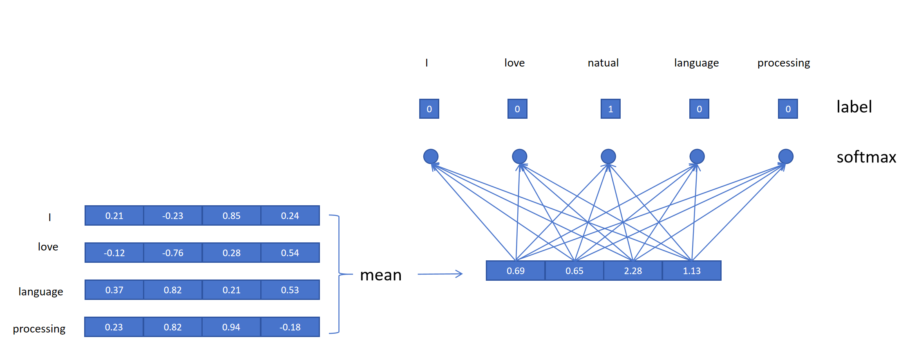

## 1. 为什么不能用词典序号编码

神经网络只能处理数字，但 Token 在词典里的**序号**不能用：

- 序号是连续变量，有大小顺序
- 但序号对应的 Token 之间**没有顺序/大小关系**
- 序号 8 会在线性层比序号 4 放大 2 倍，但语义上无此关系

所以需要一种**不引入虚假大小关系**的编码方式。

---

## 2. 独热编码（One-Hot Encoding）

### 2.1 做法

每个 Token 映射为长度 = 词典大小 V 的向量，只有对应位置为 1：

```
词典 ["我", "喜欢", "学习", "深度"], V=4
"我"   → [1, 0, 0, 0]
"喜欢" → [0, 1, 0, 0]
```

### 2.2 三大缺陷

| 缺陷 | 说明 |
|------|------|
| **维度高** | 词典 15 万 → 每个 Token 15 万维，代价太大 |
| **稀疏性强** | 大部分是 0，信息利用率低 |
| **无语义关系** | 独热向量正交（内积为 0），"土豆"和"马铃薯"毫无关系 |

现代 NLP 通常不直接使用独热编码。

---

## 3. 词嵌入（Word Embedding）

### 3.1 核心思想

把 Token 编码成**低维、稠密**的向量，让语义相似的词在空间里**位置相近**。

### 3.2 例子（维度 = 4）

| Token | 性别 | 可食用性 | 重量 | 尊贵性 |
|-------|------|---------|------|--------|
| 国王 | 0.93 | 0.13 | 0.3 | 0.98 |
| 皇后 | -0.91 | 0.11 | 0.23 | 0.97 |
| 男人 | 0.97 | 0.19 | 0.28 | 0.20 |
| 女人 | -0.93 | 0.17 | 0.21 | 0.19 |
| 土豆 | 0.01 | 0.98 | 0.05 | 0.04 |
| 马铃薯 | 0.01 | 0.97 | 0.05 | 0.04 |

观察：
- "土豆" ≈ "马铃薯"（同义词向量几乎重合）
- 国王/皇后尊贵性 > 男人/女人
- 国王/男人性别维度为正，皇后/女人为负

### 3.3 词嵌入的推理能力

$$
\text{国王} - \text{皇后} \approx \text{男人} - \text{女人}
$$

应用：知道"北京是中国的首都"，问柬埔寨的首都？

$$
\text{?} \approx \text{北京} - \text{中国} + \text{柬埔寨}
$$
找最接近的向量 → **金边**。

### 3.4 词嵌入的优势

| 优势 | 说明 |
|------|------|
| 低维稠密 | 大模型只用几千维表示一个 Token |
| 语义表达强 | 向量距离/方向体现相似性和关系 |
| 可迁移 | 预训练词向量可迁移到下游任务 |

> 注意：例子中的"性别/可食用性"等人为设定，实际每个维度的含义由神经网络决定，可能有物理含义也可能没有。

---

## 4. Word2Vec（2013，Google）

最著名的词嵌入方法，两种训练方式目标相同：**从大量无标签文本学习高质量词向量**。

共同点：基于分布式假设（词义由上下文决定）、浅层网络、无监督学习。

### 4.1 CBOW（用上下文预测中心词）

用上下文词向量的平均值预测中心词。

```
句子 "I love natural language processing"，窗口 = 前后 2 个词
输入（上下文）             输出（中心词）
["love","natural"]          "I"
["I","natural","language"]  "love"
...
```

**网络结构**：



1. 上下文词 → 各自的 Embedding
2. 取平均
3. 接线性层（神经元数 = 词典大小 V）+ Softmax
4. 用交叉熵训练，Label = 中心词

**关键**：Embedding 矩阵是可学习参数，训练目标是得到这个矩阵——每一行就是一个 Token 的词向量。

### 4.2 Skip-gram（用中心词预测上下文）

与 CBOW 相反，用中心词预测上下文词。输入只有一个 Token，不需要取平均，直接用其 Embedding 接线性分类头。

```
输入（中心词）   输出（上下文）
"I"              "love"
"I"              "natural"
"love"           "I"
...
```

### 4.3 训练技巧

需平衡常见词和罕见词：对常见词下采样、对罕见词上采样。

---

## 5. 现代大模型的做法

大模型**随机初始化**每个 Token 的 Embedding，然后**随模型任务一起训练**，得到更适合任务本身的 Token Embedding。

```
Word2Vec：独立预训练词向量 → 迁移到下游任务
大模型：Embedding 和模型一起端到端训练
```

---

## 6. 总结

```
Token 编码演进：
  序号      → 不行（引入虚假大小关系）
  独热编码  → 高维、稀疏、无语义
  词嵌入    → 低维稠密、有语义、可推理

词嵌入的神奇性质：
  国王 - 皇后 ≈ 男人 - 女人
  北京 - 中国 + 柬埔寨 ≈ 金边

Word2Vec 两种方法：
  CBOW：上下文 → 预测中心词（取平均）
  Skip-gram：中心词 → 预测上下文

本质：训练一个 Embedding 矩阵，每行是一个词的向量

现代大模型：Embedding 随任务端到端训练
```
