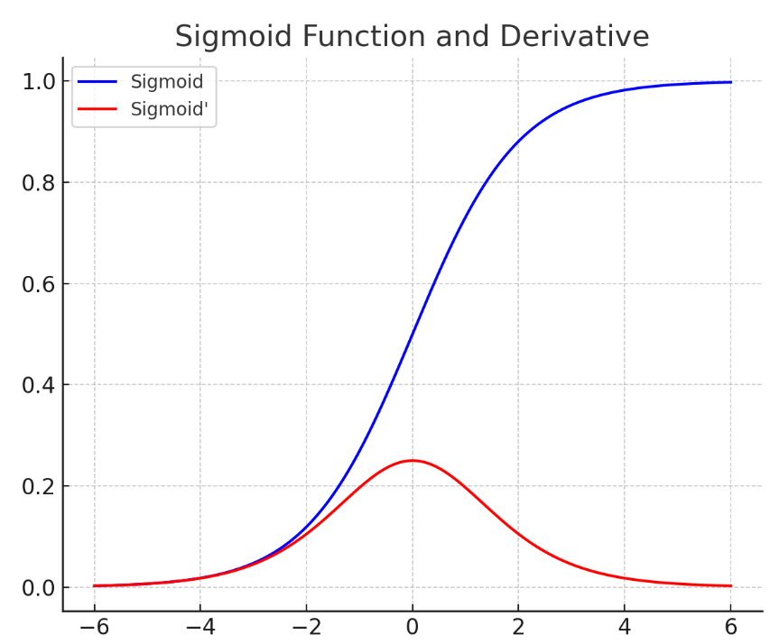
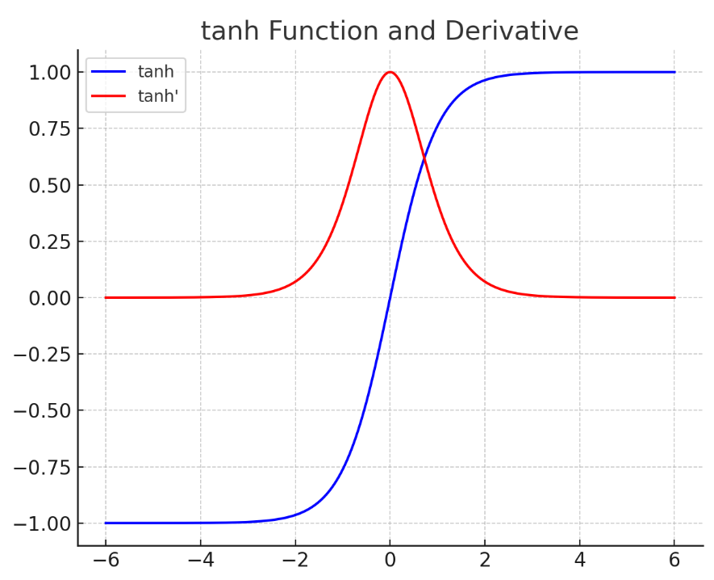
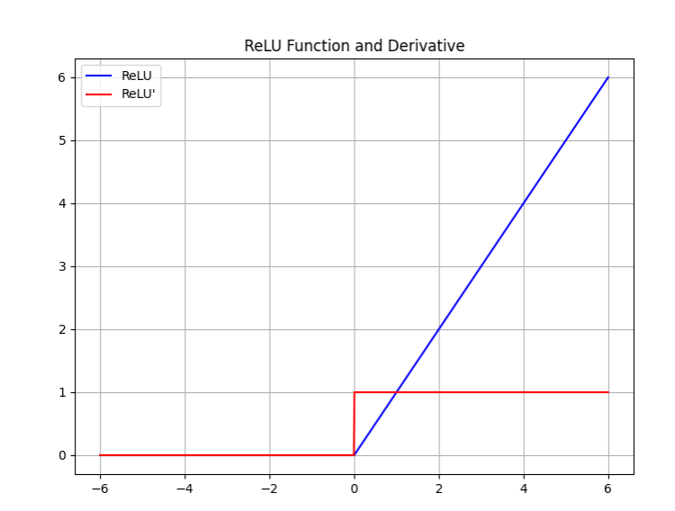

## 1. 问题根源：链式法则中的连乘

### 1.1 展开看第一层权重的梯度

以之前 3 层网络为例，第一层权重的梯度为：

$$
\frac{\partial \text{loss}}{\partial W^1} = x^T \delta^1
$$

把 $\delta^1$ 逐层展开：

$$
\frac{\partial \text{loss}}{\partial W^1} = x^T \cdot \underbrace{(a^3 - y)}_{\text{输出误差}} \cdot \underbrace{(W^3)^T \odot \text{act}'(z^2) \cdot (W^2)^T \odot \text{act}'(z^1)}_{\text{连乘项}}
$$

### 1.2 层数变深的后果

如果是 **100 层**网络，第一层权重的梯度中包含：

- **99 个**激活函数导数值连乘
- **99 个**权重矩阵连乘

连乘的性质：

| 乘数 | 100 个连乘的结果 |
|------|------------------|
| 全部 = 0.7 | $0.7^{100} \approx 3.2 \times 10^{-16}$ → **梯度消失**，参数几乎不更新 |
| 全部 = 1.5 | $1.5^{100} \approx 4.1 \times 10^{17}$ → **梯度爆炸**，参数剧烈震荡 |

> 梯度消失和梯度爆炸是深度神经网络训练的**头号障碍**。

---

## 2. 应对一：选对激活函数

梯度公式里连乘了 $\text{act}'(z)$，所以激活函数的导数值范围至关重要。

### 2.1 Sigmoid — 不适合隐藏层



| 属性 | 值 |
|------|-----|
| 导函数取值范围 | (0, 0.25] |
| 最大值 | 仅 0.25，且只在 $x=0$ 处取得 |

连乘多个 ≤0.25 的数 → **必然梯度消失**。

**结论**：Sigmoid 仅用于二分类**输出层**，不适合隐藏层。

### 2.2 Tanh — 比 Sigmoid 好，但仍有问题



| 属性 | 值 |
|------|-----|
| 导函数取值范围 | (0, 1] |
| 饱和区 | $|x| > 4$ 时导数趋近 0 |

比 Sigmoid 好（导数上限高），但输入的绝对值稍微大一点就进入饱和区，导数仍接近于 0。

### 2.3 ReLU — 深度学习默认选择



| 属性 | 值 |
|------|-----|
| $x > 0$ 时导数 | **恒为 1** |
| $x \leq 0$ 时导数 | 0（神经元抑制） |

导数为 1 意味着——正半轴上梯度在传播时**不会被缩放**，连乘再多层也不会消失。

这是 ReLU 能支持深层网络训练的根本原因。

---

## 3. 应对二：正确的参数初始化

梯度公式里还连乘了权重 $W$。权重初始化不当，同样会导致梯度消失或爆炸。

### 3.1 必须随机初始化 — 打破对称性

如果同一层的所有神经元参数初始化为相同值：
- 它们的输入相同、输出相同
- 反向传播的梯度也相同
- 每次更新后依然相同
- **多个神经元退化成一个神经元**

**初始化必须随机**，让不同神经元学到不同的特征。

### 3.2 控制方差 — Kaiming 初始化

假设输入已标准化（均值 0，方差 1）。

问题：一层有 $n$ 个输入，每个是"输入 × 权重"的累加 → 输出的方差会被放大为 $n$ 倍。层数一多，方差逐层膨胀或收缩。

再加上 ReLU 大约让一半神经元输出为 0，方差应修正为 $\frac{n}{2}$。

为了保持每层输出的方差稳定，需要将权重初始化为：

$$
\text{均值} = 0, \quad \text{标准差} = \sqrt{\frac{2}{n}}
$$

其中 $n$ 是**该层输入的数量**（即上一层的神经元数）。这就是 **Kaiming 初始化**（也叫 He 初始化）。

| 激活函数 | 推荐初始化 | 标准差 |
|----------|-----------|--------|
| ReLU | Kaiming (He) | $\sqrt{2/n}$ |
| Tanh / Sigmoid | Xavier (Glorot) | $\sqrt{1/n}$（不同变体略有差异） |

PyTorch 中定义网络层时，**框架会自动帮你完成参数初始化**，不需要手动设置。

---

## 4. 其他方法（后续会讲到）

除了激活函数和初始化，还有其他缓解梯度消失/爆炸的技术：

| 方法 | 简述 |
|------|------|
| **批量归一化（Batch Normalization）** | 在每层内部对输出做标准化，保证数值稳定 |
| **残差连接（Residual Connection）** | 给梯度提供一条"高速公路"，跳过中间层直接往前传 |

---

## 5. 总结

```
问题：链式法则导致前层梯度 = 大量导数连乘
     ├── 每项 < 1  → 梯度消失（深层参数几乎不更新）
     └── 每项 > 1  → 梯度爆炸（参数震荡发散）

三大应对：
     ├── 激活函数   → ReLU（正半轴导数 = 1，不衰减）
     ├── 参数初始化 → 随机 + Kaiming（方差 √(2/n)）
     └── (后续)     → 批量归一化、残差连接

为什么 ReLU 能支持深层网络：
    Sigmoid 导数 ≤ 0.25  → 10 层后梯度 ≈ 0
    ReLU 正半轴导数 = 1  → 100 层后梯度依然在
```
