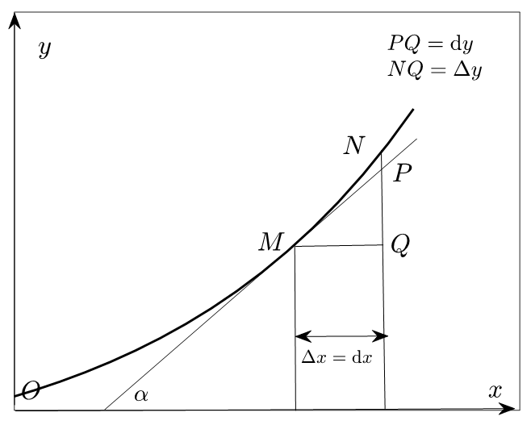

## 微分方程

### 微分方程理论基础

> 微分方程的目的：通过将函数*f*和它的若干阶导数联系起来形成一个方程（组），来求出函数的解析式或函数值随自变量变化的曲线。

**函数、导数与微分**

> 导数： 函数在某一点处切线的斜率。
>
> 微分：当对自变量x施加一个非常小的增量*dx*时，函数值相应的变化量与*dx*之间的关系。
>
> 关系：当*dx*非常小的时候，函数的变化量就接近于在该点处切线的变化量*dy*。

$$
 \frac{dy}{dx} = f^{'}(x)
$$




> 微分实际上描述的是点*M*处切线的斜率；导数则描述的是割线*MN*的斜率。但当d*x*足够小的时候，切线的斜率和割线的斜率就会非常接近
>
> 割线是与曲线相交于两个点的直线
>
> 切线是刚好"触碰"曲线于一个点的直线

> 求积分。
>
> 不定积分：是根据已知的导数反推出原函数
>
> 定积分：在反推出原函数后，还需要计算该函数在特定区间内的值的差异。
>
> 通过查阅常见函数的导数表来进行微分和不定积分的计算。

**一阶线性微分方程的解**

一阶线性微分方程
$$
\frac{dy}{dx} + yP(x) = Q(x)
$$

> *y*是一个未知函数,*P*和*Q*是已知的函数。
>
> 目标是找出*y*的解，即它的通解形式.

> 通常采用**分离变量积分法**和**常数变易法**

解一个特殊情况的齐次方程,当$Q(x)=0$时

$$
\frac{dy}{dx} + yP(x) = 0
$$


> 变量分离和变形

$$
\frac{1}{y}dy = P(x)dx
$$

> 对两边进行不定积分,得到解的通式

$$
y = C \exp\{-\int P(x)  dx \}
$$

一般情况下$Q(x)$ 不一定为0,将常数*$C$*替换为一个函数$C(x)$.然后对*$y$*求导并将其代入原方程中以求得$C(x)$​的通解。
$$
y=exp\{-\int P(x)dx\}[\int Q(x)exp\{\int P(x)dx \}dx + C]
$$
**二阶常系数线性微分方程的解**

二阶常系数线性微分方程:
$$
f^{"}(x) + pf^{'}(x)+qf(x) = C(x)
$$

> 先考虑对应的齐次方程,让C(x)为0：

$$
f^{"}(x) + pf^{'}(x)+qf(x) = 0
$$

> 解二阶常系数齐次线性微分方程时，我们通常使用特征根法。

$$
r^{2}+pr+q=0
$$

> 齐次方程的解的形式取决于特征方程的根。根据特征方程的不同实根、相同实根、或共轭复根，齐次微分方程的解会有不同的形式：

$$
\begin{cases}
  y = C_1e^{\alpha_{1}x}+C_2e^{\alpha_{2}x} & r_1 = \alpha_1,r_2=\alpha_2(1) \\
  y=(C_1x+C_2)e^{\alpha x}&r_1=r_2=\alpha(2) \\
  y=e^{\alpha x}[C_1\sin(\beta x) + C_2\cos(\beta x)]&r=\alpha \pm \beta i(3)
  \end{cases}
$$

> 对于一般的二阶非齐次线性微分方程，我们可以根据右侧C*(*x*)的形式推导出一个特解。
>
> **非齐次方程的通解等于齐次方程的通解加上非齐次方程的特解**
>
> 存在两种特殊形式：

$$
C(x) = P_m(x)e^{\lambda x}
$$

$$
C(x) = e^{\lambda x}[P_m\cos(\omega x) + Q_i(x)\sin(\omega x)]. i = \max\{m,n\}
$$

> $P_m(x)$是一个m*次多项式，$Q_n(x)$是一个n次多项式。

两种形式的特解分别为:
$$
f(x) = x_kP_m(x)e^{\lambda x}
$$

$$
f(x) = x^ke^{\lambda x}[P_i\cos(\omega x) + Q_i(x)\sin(\omega x)]. i = \max\{m,n\}
$$

> *k*的取值取决于特征方程根的个数：如果有两个不同的实根，则k*=2；如果有两个相同的实根，则k*=1；如果没有实根，则k=0。

### Numpy和SciPy进行函数的微分和积分计算

计算函数`f(x) = cos(2πx) * exp(-x) + 1.2`在区间`[0, 0.7]`上的定积分

```python
import numpy as np
from scipy.integrate import quad
# 定义函数
def f(x):
    return np.cos(2 * np.pi * x) * np.exp(-x) + 1.2
# 计算定积分
integral, error = quad(f, 0, 0.7)
print(f'定积分的结果是：{integral}')
# 定积分的结果是：0.7951866427656943 

# integral 返回的是积分近似值
# error    返回的是误差估计（绝对误差的上界）
# quad 底层使用自适应高斯-克朗罗德求积法，适合光滑函数的高精度数值积分。
```

使用梯形法则来近似计算函数的定积分

```python
h=x[1]-x[0]
xn=0.7
s=0
for i in range(1000):
    xn1=xn+h
    yn=np.cos(2*np.pi*xn)*np.exp(-xn)+1.2
    yn1=np.cos(2*np.pi*xn1)*np.exp(-xn1)+1.2
    s0=(yn+yn1)*h/2
    s+=s0
    xn=xn1
s
# 24.31183595181452
```

函数的微分使用Numpy库中的`gradient`函数来近似求解。

求解函数`f(x) = x^2`在点`x = 1`处的导数

```python
# 定义x的取值范围和步长
# 100个等距点: 0, 0.0202, ..., 2
x = np.linspace(0,2,100)
y = x ** 2
# 计算导数
dydx = np.gradient(y,x)
# 在x = 1处的导数值
 # 找 x 中最接近 1.0 的下标
derivate_at_1 = dydx[np.argmin(abs(x-1))]
print(f'在x = 1处的导数值是：{derivate_at_1}')

# linspace(a,b,n)   在 [a,b] 内均匀撒 n 个点   等距采样
# gradient(y,x)    数值求导 dy/dx              差分代替微分
# argmin(arr)      返回最小值的索引             找位置
```

### Scipy和Sympy解微分方程


