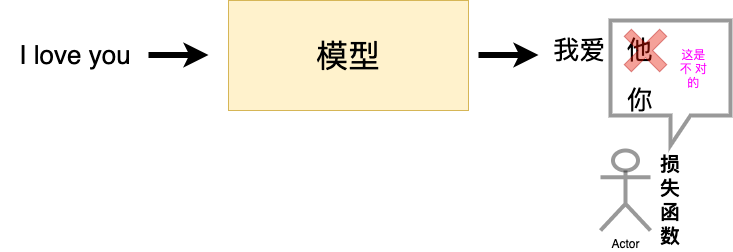
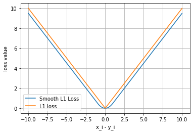

# 损失函数

> 一个模型想要达到很好的效果需要**学习**，也就是我们常说的训练。一个好的训练离不开优质的负反馈，这里的损失函数就是模型的负反馈。



**损失函数是数据输入到模型当中，产生的结果与真实标签的评价指标，模型可以按照损失函数的目标来做出改进。**


## 二分类交叉熵损失函数

```python
torch.nn.BCELoss(weight=None, size_average=None, reduce=None, reduction='mean')
```

**功能**：计算二分类任务时的交叉熵（Cross Entropy）函数。

在二分类中，label是{0,1}。对于进入交叉熵函数的input为**概率分布**的形式。一般来说，input为**sigmoid激活层**的输出，或者**softmax**的输出。

**主要参数**：

`weight`:每个类别的loss设置权值

`size_average`:数据为bool，为True时，返回的loss为平均值；为False时，返回的各样本的loss之和。

`reduce`:数据类型为bool，为True时，loss的返回是标量。
$$
\ell(x, y) = 
\begin{cases} 
\text{mean}(L), & \text{if reduction} = \text{'mean'} \\
\text{sum}(L), & \text{if reduction} = \text{'sum'}
\end{cases}
$$

```python
m = nn.Sigmoid()
loss = nn.BCELoss()
input = torch.randn(3, requires_grad=True)
target = torch.empty(3).random_(2)
output = loss(m(input), target)
output.backward()
```

```python
print('BCELoss损失函数的计算结果为',output)
```

```python
BCELoss损失函数的计算结果为 tensor(0.5732, grad_fn=<BinaryCrossEntropyBackward>)
```


##  交叉熵损失函数

```python
torch.nn.CrossEntropyLoss(weight=None, size_average=None, ignore_index=-100, reduce=None, reduction='mean')
```

**功能**：计算交叉熵函数

**主要参数**：

`weight`:每个类别的loss设置权值。

`size_average`:数据为bool，为True时，返回的loss为平均值；为False时，返回的各样本的loss之和。

`ignore_index`:忽略某个类的损失函数。

`reduce`:数据类型为bool，为True时，loss的返回是标量。
$$
\mathrm{loss}(x, \mathrm{class}) = -\log\left(\frac{\exp(x[\mathrm{class}])}{\sum_j \exp(x[j])}\right) = -x[\mathrm{class}] + \log\left(\sum_j \exp(x[j])\right)
$$

```python
loss = nn.CrossEntropyLoss()
input = torch.randn(3, 5, requires_grad=True)
target = torch.empty(3, dtype=torch.long).random_(5)
output = loss(input, target)
output.backward()
```

```python
print(output)
```

```python
tensor(2.0115, grad_fn=<NllLossBackward>)
```


## L1损失函数

```python
torch.nn.L1Loss(size_average=None, reduce=None, reduction='mean')
```

**功能：** 计算输出`y`和真实标签`target`之间的差值的绝对值。

`reduction`参数决定了计算模式。有三种计算模式可选：none：逐个元素计算。 sum：所有元素求和，返回标量。 mean：加权平均，返回标量。 如果选择`none`，那么返回的结果是和输入元素相同尺寸的。默认计算方式是求平均。
$$
L_n = |x_n - y_n|
$$

```python
loss = nn.L1Loss()
input = torch.randn(3, 5, requires_grad=True)
target = torch.randn(3, 5)
output = loss(input, target)
output.backward()
```

```python
print('L1损失函数的计算结果为',output)
```

```python
L1损失函数的计算结果为 tensor(1.5729, grad_fn=<L1LossBackward>)
```


## MSE损失函数

```python
torch.nn.MSELoss(size_average=None, reduce=None, reduction='mean')
```

**功能：** 计算输出`y`和真实标签`target`之差的平方。

和`L1Loss`一样，`MSELoss`损失函数中，`reduction`参数决定了计算模式。有三种计算模式可选：none：逐个元素计算。 sum：所有元素求和，返回标量。默认计算方式是求平均。
$$
l_n = (x_n - y_n)^2
$$

```python
loss = nn.MSELoss()
input = torch.randn(3, 5, requires_grad=True)
target = torch.randn(3, 5)
output = loss(input, target)
output.backward()
```

```python
print('MSE损失函数的计算结果为',output)
```

```python
MSE损失函数的计算结果为 tensor(1.6968, grad_fn=<MseLossBackward>)
```


## 平滑L1 (Smooth L1)损失函数

```python
torch.nn.SmoothL1Loss(size_average=None, reduce=None, reduction='mean', beta=1.0)
```

**功能：** L1的平滑输出，其功能是减轻离群点带来的影响

`reduction`参数决定了计算模式。有三种计算模式可选：none：逐个元素计算。 sum：所有元素求和，返回标量。默认计算方式是求平均。

**提醒：** 之后的损失函数中，关于`reduction` 这个参数依旧会存在。
$$
\mathrm{loss}(x,y) = \frac{1}{n}\sum_{i=1}^{n} z_i   \newline
z_i=
\begin{cases}
0.5(x_i-y_i)^2, & \text{if } |x_i-y_i|<1 \\
|x_i-y_i|-0.5, & \text{otherwise}
\end{cases}
$$

```python
loss = nn.SmoothL1Loss()
input = torch.randn(3, 5, requires_grad=True)
target = torch.randn(3, 5)
output = loss(input, target)
output.backward()
```

```python
print('SmoothL1Loss损失函数的计算结果为',output)
```

```python
SmoothL1Loss损失函数的计算结果为 tensor(0.7808, grad_fn=<SmoothL1LossBackward>)
```


**平滑L1与L1的对比**

```python
inputs = torch.linspace(-10, 10, steps=5000)
target = torch.zeros_like(inputs)

loss_f_smooth = nn.SmoothL1Loss(reduction='none')
loss_smooth = loss_f_smooth(inputs, target)
loss_f_l1 = nn.L1Loss(reduction='none')
loss_l1 = loss_f_l1(inputs,target)

plt.plot(inputs.numpy(), loss_smooth.numpy(), label='Smooth L1 Loss')
plt.plot(inputs.numpy(), loss_l1, label='L1 loss')
plt.xlabel('x_i - y_i')
plt.ylabel('loss value')
plt.legend()
plt.grid()
plt.show()
```



对于`smoothL1`来说，在 0 这个尖端处，过渡更为平滑。


## 目标泊松分布的负对数似然损失

```python
torch.nn.PoissonNLLLoss(log_input=True, full=False, size_average=None, eps=1e-08, reduce=None, reduction='mean')
```

**功能：** 泊松分布的负对数似然损失函数

**主要参数：**

`log_input`：输入是否为对数形式，决定计算公式。

`full`：计算所有 loss，默认为 False。

`eps`：修正项，避免 input 为 0 时，log(input) 为 nan 的情况。
$$
% log_input=True
\text{当参数}\log\_input=\text{True}:\quad \mathrm{loss}(x_n,y_n)=e^{x_n}-x_n\cdot y_n
\newline
% log_input=False
\text{当参数}\log\_input=\text{False}:\quad \mathrm{loss}(x_n,y_n)=x_n-y_n\cdot\log(x_n+\mathrm{eps})
$$

```python
loss = nn.PoissonNLLLoss()
log_input = torch.randn(5, 2, requires_grad=True)
target = torch.randn(5, 2)
output = loss(log_input, target)
output.backward()
```

```python
print('PoissonNLLLoss损失函数的计算结果为',output)
```

```python
PoissonNLLLoss损失函数的计算结果为 tensor(0.7358, grad_fn=<MeanBackward0>)
```


## KL散度

```python
torch.nn.KLDivLoss(size_average=None, reduce=None, reduction='mean', log_target=False)
```

**功能：** 计算KL散度，也就是计算相对熵。用于连续分布的距离度量，并且对离散采用的连续输出空间分布进行回归通常很有用。

**参数：**`reduction`：计算模式，可为 `none`/`sum`/`mean`/`batchmean`。

```dtd
none：逐个元素计算。

sum：所有元素求和，返回标量。

mean：加权平均，返回标量。

batchmean：batchsize 维度求平均值。
```

$$
\begin{aligned}
D_{\text{KL}}(P,Q)
&= \mathbb{E}_{X\sim P}\left[\log\frac{P(X)}{Q(X)}\right] \\
&= \mathbb{E}_{X\sim P}\big[\log P(X)-\log Q(X)\big] \\
&= \sum_{i=1}^{n} P(x_i)\big(\log P(x_i)-\log Q(x_i)\big)
\end{aligned}
$$

```python
inputs = torch.tensor([[0.5, 0.3, 0.2], [0.2, 0.3, 0.5]])
target = torch.tensor([[0.9, 0.05, 0.05], [0.1, 0.7, 0.2]], dtype=torch.float)
loss = nn.KLDivLoss()
output = loss(inputs,target)

print('KLDivLoss损失函数的计算结果为',output)
```

```python
KLDivLoss损失函数的计算结果为 tensor(-0.3335)
```


## MarginRankingLoss

```python
torch.nn.MarginRankingLoss(margin=0.0, size_average=None, reduce=None, reduction='mean')
```

**功能：** 计算两个向量之间的相似度，用于排序任务。该方法用于计算两组数据之间的差异。

**主要参数:**

`margin`：边界值， 与 之间的差异值。

`reduction`：计算模式，可为 none/sum/mean。
$$
\mathrm{loss}(x_1,x_2,y)=\max\big(0,\ -y\cdot(x_1-x_2)+\mathrm{margin}\big)
$$

```python
loss = nn.MarginRankingLoss()
input1 = torch.randn(3, requires_grad=True)
input2 = torch.randn(3, requires_grad=True)
target = torch.randn(3).sign()
output = loss(input1, input2, target)
output.backward()

print('MarginRankingLoss损失函数的计算结果为',output)
```

```python
MarginRankingLoss损失函数的计算结果为 tensor(0.7740, grad_fn=<MeanBackward0>)
```


## 多标签边界损失函数

```python
torch.nn.MultiLabelMarginLoss(size_average=None, reduce=None, reduction='mean')
```

**功能：** 对于多标签分类问题计算损失函数。

`reduction`：计算模式，可为 none/sum/mean。
$$
\mathrm{loss}(x,y)=\sum_{i,j}\frac{\max\big(0,\ 1-x[y[j]]-x[i]\big)}{x.\mathrm{size}(0)}
$$

$$
\text{其中 } i=0,\dots,x.\mathrm{size}(0),\ j=0,\dots,y.\mathrm{size}(0),
\text{ 对于所有的 }i\text{ 和 }j,\text{ 都有 }y[j]\ge0\text{ 并且 }i\neq y[j]
$$

```python
loss = nn.MultiLabelMarginLoss()
x = torch.FloatTensor([[0.9, 0.2, 0.4, 0.8]])
# for target y, only consider labels 3 and 0, not after label -1
y = torch.LongTensor([[3, 0, -1, 1]])# 真实的分类是，第3类和第0类
output = loss(x, y)

print('MultiLabelMarginLoss损失函数的计算结果为',output)
```

```python
MultiLabelMarginLoss损失函数的计算结果为 tensor(0.4500)
```


## 二分类损失函数

```python
torch.nn.SoftMarginLoss(size_average=None, reduce=None, reduction='mean')torch.nn.(size_average=None, reduce=None, reduction='mean')
```

**功能：** 计算二分类的 logistic 损失。

`reduction`：计算模式，可为 none/sum/mean。
$$
\mathrm{loss}(x,y)=\sum_{i}\frac{\log\big(1+\exp(-y[i]\cdot x[i])\big)}{x.\mathrm{nelement}()}
$$
其中$x.\mathrm{nelement}()$为输入x中的样本个数。注意这里y也有 1 和  -1 两种格式。

```python
inputs = torch.tensor([[0.3, 0.7], [0.5, 0.5]])  # 两个样本，两个神经元
target = torch.tensor([[-1, 1], [1, -1]], dtype=torch.float)  # 该 loss 为逐个神经元计算，需要为每个神经元单独设置标签

loss_f = nn.SoftMarginLoss()
output = loss_f(inputs, target)

print('SoftMarginLoss损失函数的计算结果为',output)
```

```python
SoftMarginLoss损失函数的计算结果为 tensor(0.6764)
```


## 多分类的折页损失

```python
torch.nn.MultiMarginLoss(p=1, margin=1.0, weight=None, size_average=None, reduce=None, reduction='mean')
```

**功能：** 计算多分类的折页损失

**主要参数:**

`reduction`：计算模式，可为 none/sum/mean。

`p：`可选 1 或 2。

`weight`：各类别的 loss 设置权值。

`margin`：边界值
$$
\mathrm{loss}(x,y)=\frac{\sum_i \max\big(0,\mathrm{margin}-x[y]+x[i]\big)^p}{x.\mathrm{size}(0)}
$$
其中，$x \in \{0,\dots,x.\mathrm{size}(0)-1\}，y \in \{0,\dots,y.\mathrm{size}(0)-1\}$，并且对于所有的$i$和$j$，都有$0 \le y[j] \le x.\mathrm{size}(0)-1，以及i \neq y[j]$。

```python
inputs = torch.tensor([[0.3, 0.7], [0.5, 0.5]]) 
target = torch.tensor([0, 1], dtype=torch.long) 

loss_f = nn.MultiMarginLoss()
output = loss_f(inputs, target)

print('MultiMarginLoss损失函数的计算结果为',output)
```

```python
MultiMarginLoss损失函数的计算结果为 tensor(0.6000)
```


## 三元组损失

```python
torch.nn.TripletMarginLoss(margin=1.0, p=2.0, eps=1e-06, swap=False, size_average=None, reduce=None, reduction='mean')
```

**功能：** 计算三元组损失。

**三元组:** 这是一种数据的存储或者使用格式。<实体1，关系，实体2>。在项目中，也可以表示为< `anchor`, `positive examples` , `negative examples`>

在这个损失函数中，我们希望去`anchor`的距离更接近`positive examples`，而远离`negative examples`

**主要参数:**

`reduction`：计算模式，可为 none/sum/mean。

`p：`可选 1 或 2。

`margin`：边界值
$$
L(a,p,n) = \max\left\{d(a_i,p_i) - d(a_i,n_i) + \mathrm{margin}, 0\right\} \newline
d(x_i,y_i) = \left\|\mathbf{x}_i - \mathbf{y}_i\right\|
$$

```python
triplet_loss = nn.TripletMarginLoss(margin=1.0, p=2)
anchor = torch.randn(100, 128, requires_grad=True)
positive = torch.randn(100, 128, requires_grad=True)
negative = torch.randn(100, 128, requires_grad=True)
output = triplet_loss(anchor, positive, negative)
output.backward()
print('TripletMarginLoss损失函数的计算结果为',output)
```

```python
TripletMarginLoss损失函数的计算结果为 tensor(1.1667, grad_fn=<MeanBackward0>)
```


## HingEmbeddingLoss

```python
torch.nn.HingeEmbeddingLoss(margin=1.0, size_average=None, reduce=None, reduction='mean')
```

**功能：** 对输出的embedding结果做Hing损失计算

**主要参数:**

`reduction`：计算模式，可为 none/sum/mean。

`margin`：边界值
$$
l_n=
\begin{cases}
x_n, & \text{if } y_n=1 \\
\max\{0,\Delta-x_n\}, & \text{if } y_n=-1
\end{cases}
$$
注意事项：输入x应为两个输入之差的绝对值

如果输出的是正例$y_n=1$,那么loss就是x，如果输出的是负例$y_n=-1$，那么输出的loss就是要做一个比较。


## 余弦相似度

```python
torch.nn.CosineEmbeddingLoss(margin=0.0, size_average=None, reduce=None, reduction='mean')
```

**功能：** 对两个向量做余弦相似度

**主要参数:**

`reduction`：计算模式，可为 none/sum/mean。

`margin`：可取值[-1,1] ，推荐为[0,0.5] 
$$
\mathrm{loss}(x,y)=
\begin{cases}
1-\cos(x_1,x_2), & \text{if } y=1 \\
\max\left\{0,\cos(x_1,x_2)-\mathrm{margin}\right\}, & \text{if } y=-1
\end{cases}
\newline
\cos(\theta)=\frac{A\cdot B}{\|A\|\|B\|}=\frac{\sum_{i=1}^{n}A_i\times B_i}{\sqrt{\sum_{i=1}^{n}(A_i)^2}\times\sqrt{\sum_{i=1}^{n}(B_i)^2}}
$$
对于两个向量，做余弦相似度。将余弦相似度作为一个距离的计算方式，如果两个向量的距离近，则损失函数值小，反之亦然。

```python
loss_f = nn.CosineEmbeddingLoss()
inputs_1 = torch.tensor([[0.3, 0.5, 0.7], [0.3, 0.5, 0.7]])
inputs_2 = torch.tensor([[0.1, 0.3, 0.5], [0.1, 0.3, 0.5]])
target = torch.tensor([1, -1], dtype=torch.float)
output = loss_f(inputs_1,inputs_2,target)

print('CosineEmbeddingLoss损失函数的计算结果为',output)
```

```python
CosineEmbeddingLoss损失函数的计算结果为 tensor(0.5000)
```


## CTC损失函数

```python
torch.nn.CTCLoss(blank=0, reduction='mean', zero_infinity=False)
```

**功能：** 用于解决时序类数据的分类

计算连续时间序列和目标序列之间的损失。CTCLoss对输入和目标的可能排列的概率进行求和，产生一个损失值，这个损失值对每个输入节点来说是可分的。输入与目标的对齐方式被假定为 "多对一"，这就限制了目标序列的长度，使其必须是≤输入长度

**主要参数:**

`reduction`：计算模式，可为 none/sum/mean。

`blank`：blank label。

`zero_infinity`：无穷大的值或梯度值为

```python
# Target are to be padded
T = 50      # Input sequence length
C = 20      # Number of classes (including blank)
N = 16      # Batch size
S = 30      # Target sequence length of longest target in batch (padding length)
S_min = 10  # Minimum target length, for demonstration purposes

# Initialize random batch of input vectors, for *size = (T,N,C)
input = torch.randn(T, N, C).log_softmax(2).detach().requires_grad_()

# Initialize random batch of targets (0 = blank, 1:C = classes)
target = torch.randint(low=1, high=C, size=(N, S), dtype=torch.long)

input_lengths = torch.full(size=(N,), fill_value=T, dtype=torch.long)
target_lengths = torch.randint(low=S_min, high=S, size=(N,), dtype=torch.long)
ctc_loss = nn.CTCLoss()
loss = ctc_loss(input, target, input_lengths, target_lengths)
loss.backward()


# Target are to be un-padded
T = 50      # Input sequence length
C = 20      # Number of classes (including blank)
N = 16      # Batch size

# Initialize random batch of input vectors, for *size = (T,N,C)
input = torch.randn(T, N, C).log_softmax(2).detach().requires_grad_()
input_lengths = torch.full(size=(N,), fill_value=T, dtype=torch.long)

# Initialize random batch of targets (0 = blank, 1:C = classes)
target_lengths = torch.randint(low=1, high=T, size=(N,), dtype=torch.long)
target = torch.randint(low=1, high=C, size=(sum(target_lengths),), dtype=torch.long)
ctc_loss = nn.CTCLoss()
loss = ctc_loss(input, target, input_lengths, target_lengths)
loss.backward()

print('CTCLoss损失函数的计算结果为',loss)
```

```python
CTCLoss损失函数的计算结果为 tensor(16.0885, grad_fn=<MeanBackward0>)
```
